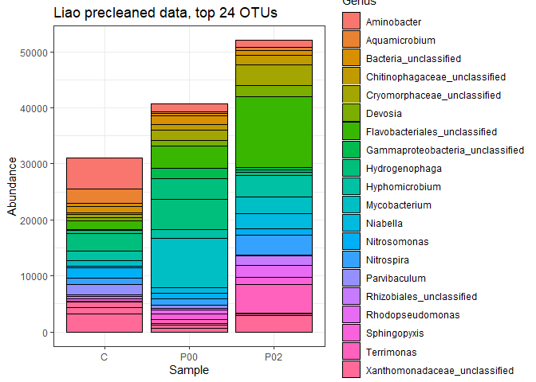
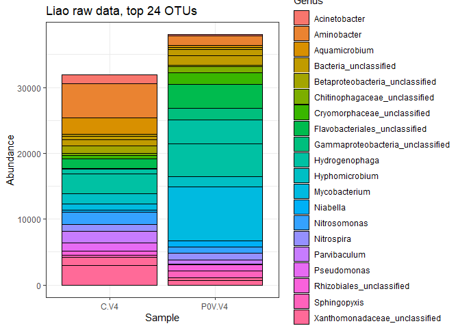
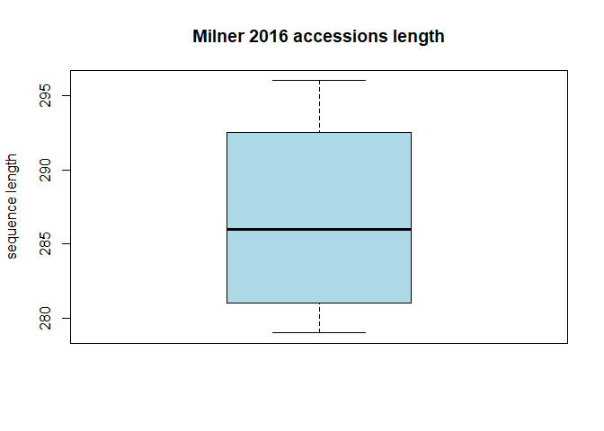
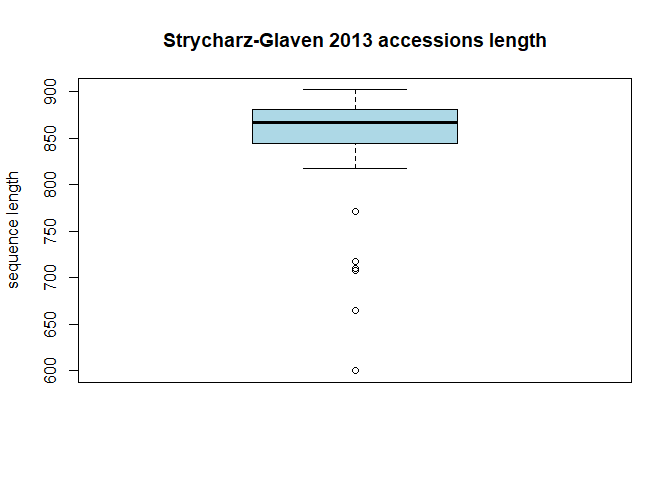
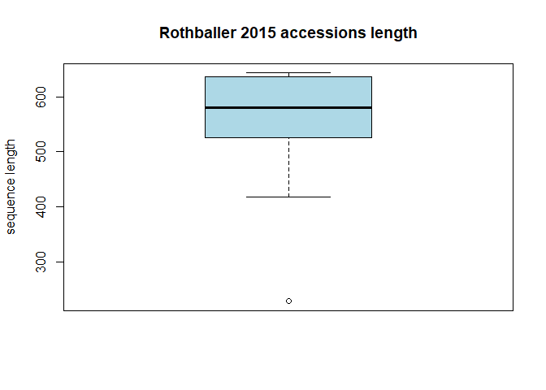
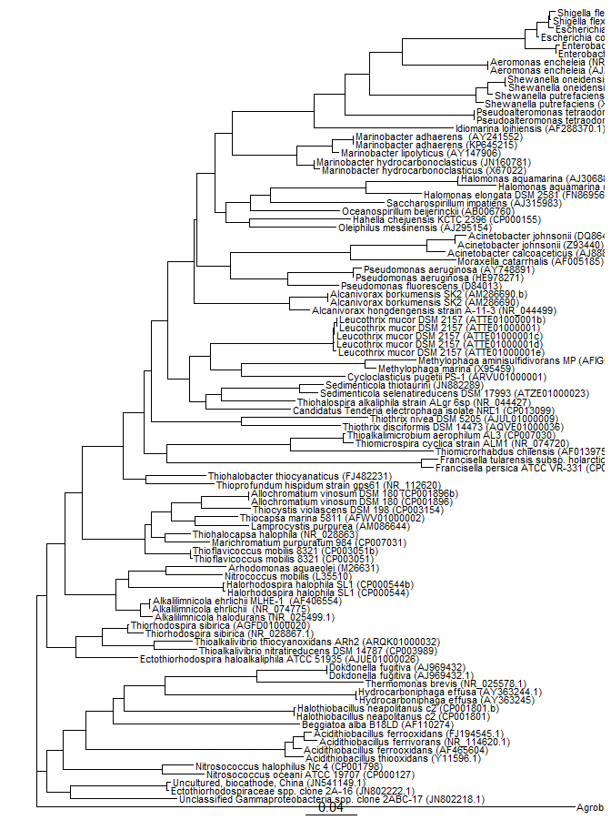
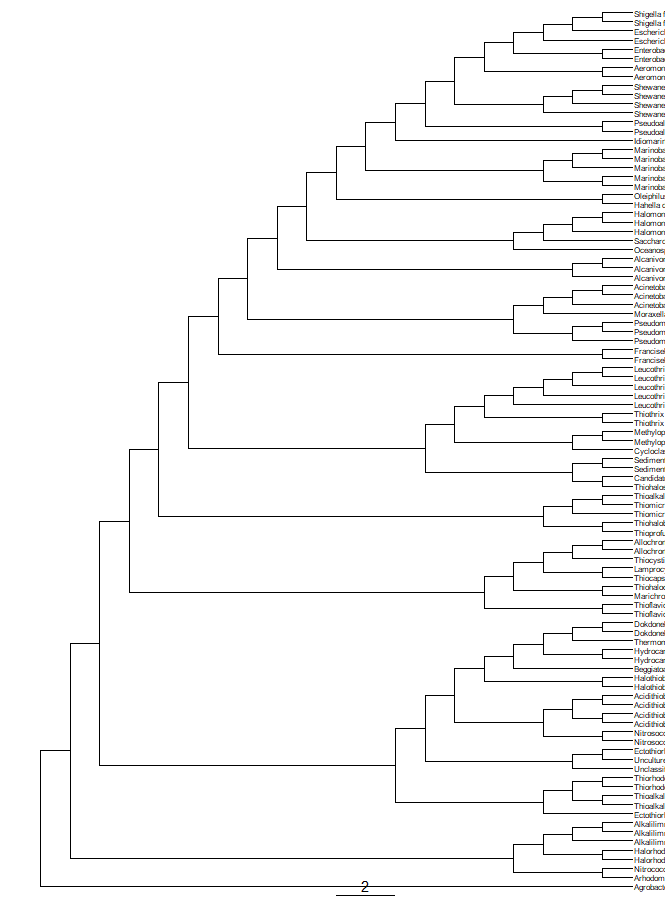
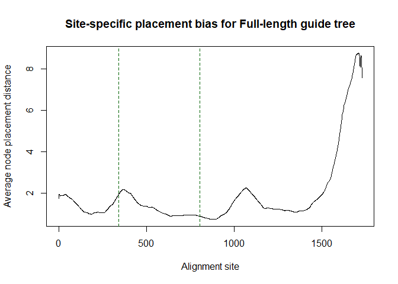

# Introduction

This is the log file for the phylogenetic placement of selected OTUs of the 
unclassified $\gamma$-proteobacteria from the biocathode. We used different
references for evolutionary placement:

1. Eddie *et al.* 2016 (IJSEM): we recreated the 16S tree from figure 1 to the 
best of our possiblities, but relied mainly on SILVA LTP (and if not available 
there on Ref NR) for high-quality 16S reference sequences.
2. Adding full-length references of the tree from supplementary information from 
Milner *et al.* 2016 (J. Power. Src.), here both SILVA LTP (and if not available 
Ref NR) were used but only secondary to the actual accessions.
3. Two *gammaproteobacteria* accessions from Xia *et al.* 2012 (BRT).
4. Using a selection of papers by Antonin Prevoteau (1.) we build a reference tree of all
reads that are >1200 nucleotides (quality cutoff set by the RDP) and classify as 
gammaproteobacteria (see publications above).
Next, an EPA is run to place all shorter reads onto the tree.

In all cases the selected outgroup sequence was the Alphaproteobacterium 
*Agrobacterium fabrum* C58 (AE007869)

For short reads (<500 nt) we chose to apply two different evolutionary placement
strategies:

1. The standard RAxML evolutionary placement algorithm (EPA). More info in Berger 
*et al.* (2011) [here](https://academic.oup.com/sysbio/article/60/3/291/1667010)
2. The novel EPA-NG, which integrates concepts from RAxML-EPA and pplacer. More 
info in Barbera *et al.* (2018) [here](https://www.biorxiv.org/content/early/2018/04/17/291658)

All resulting trees can be found on iTOL (Letunic & Bork, 2016) in the shared 
projects link [here](http://itol.embl.de/shared/FM_Kerckhof)

# Gathering data and re-classification.

## Preprocessing the Liao et al. 2018 

All data was downloaded to the CMET computational infrastructure, un-rarred and 
un-gzipped. Data can be obtained from the original authors. 
Using the information provided by the authors the `files` file and 
the `oligos` file were created. We also set `checkorient=TRUE` to be safe 
(Illumina V4 HiSeq by Novogene: forward primer 515F (5′-GTGCCAGCMGCCGCGGTAA-3′) 
and reverse primer 806R (5′-GGACTACHVGGGTWTCTAAT-3′)). 

### Data precleaned by Liao et al.

In each data folder we found both raw data and pre-cleaned data. It appears that 
this cleanup mainly involved barcode and primer removal. We will start with the
precleaned data below and process it through CMET's default (mothur 1.42.3) 
pipeline, which is almost entirely based on the [Schloss lab MiSeq SOP](https://mothur.org/wiki/miseq_sop/) 


```bash
<!-- [NOTE]: Setting random seed to 19760620. -->
> make.contigs(file=cleanrelev.files,processors=12)
<!-- Using 12 processors. -->
<!-- # >>>>>   Processing file pair DMP06542_L1_P0V_1.fq - DMP06542_L1_P0V_2.fq (files 1 of 3) <<<<< -->
<!-- # Making contigs... -->
<!-- It took 27 secs to assemble 81155 reads. -->
<!-- # >>>>>   Processing file pair DMP06542_L1_P0.2V_1.fq - DMP06542_L1_P0.2V_2.fq (files 2 of 3)     <<<<< -->
<!-- Making contigs... -->
<!-- It took 32 secs to assemble 93251 reads. -->
<!-- # >>>>>   Processing file pair DMP06542_L1_C_1.fq - DMP06542_L1_C_2.fq (files 3 of 3)     <<<<< -->
<!-- Making contigs... -->
<!-- It took 28 secs to assemble 89292 reads. -->
<!-- Group count: -->
<!-- C       89292 -->
<!-- P00     81155 -->
<!-- P02     93251 -->
<!-- Total of all groups is 263698 -->
<!-- It took 88 secs to process 263698 sequences. -->
<!-- Output File Names: -->
<!-- cleanrelev.trim.contigs.fasta -->
<!-- cleanrelev.trim.contigs.qual -->
<!-- cleanrelev.scrap.contigs.fasta -->
<!-- cleanrelev.scrap.contigs.qual -->
<!-- cleanrelev.contigs.report -->
<!-- cleanrelev.contigs.groups -->

> summary.seqs(fasta=current)
<!-- Using cleanrelev.trim.contigs.fasta as input file for the fasta parameter. -->
<!-- Using 12 processors. -->
<!--                 Start   End     NBases  Ambigs  Polymer NumSeqs -->
<!-- Minimum:        1       45      45      0       3       1 -->
<!-- 2.5%-tile:      1       253     253     0       3       6593 -->
<!-- 25%-tile:       1       253     253     0       4       65925 -->
<!-- Median:         1       253     253     0       4       131850 -->
<!-- 75%-tile:       1       253     253     0       5       197774 -->
<!-- 97.5%-tile:     1       254     254     1       6       257106 -->
<!-- Maximum:        1       400     400     151     90      263698 -->
<!-- Mean:   1       253     253     0       4 -->
<!-- # of Seqs:      263698 -->
<!-- It took 2 secs to summarize 263698 sequences. -->
<!-- Output File Names: -->
<!-- cleanrelev.trim.contigs.summary -->

> screen.seqs(fasta=cleanrelev.trim.contigs.fasta, group=cleanrelev.contigs.groups, maxambig=0, minlength=253, maxlength=254, processors=10)
<!-- It took 1 secs to screen 263698 sequences, removed 15730. -->
<!-- /******************************************/ -->
<!-- Running command: remove.seqs(accnos=cleanrelev.trim.contigs.bad.accnos.temp, group=cleanrelev.contigs.groups) -->
<!-- Removed 15730 sequences from your group file. -->
<!-- Output File Names: -->
<!-- cleanrelev.contigs.pick.groups -->

<!-- /******************************************/ -->
<!-- Output File Names: -->
<!-- cleanrelev.trim.contigs.good.fasta -->
<!-- cleanrelev.trim.contigs.bad.accnos -->
<!-- cleanrelev.contigs.good.groups -->
<!-- It took 2 secs to screen 263698 sequences. -->

> summary.seqs(fasta=current)                                                                   
<!-- Using cleanrelev.trim.contigs.good.fasta as input file for the fasta parameter. -->
<!-- Using 10 processors. -->
<!--                 Start   End     NBases  Ambigs  Polymer NumSeqs -->
<!-- Minimum:        1       253     253     0       3       1 -->
<!-- 2.5%-tile:      1       253     253     0       3       6200 -->
<!-- 25%-tile:       1       253     253     0       4       61993 -->
<!-- Median:         1       253     253     0       4       123985 -->
<!-- 75%-tile:       1       253     253     0       5       185977 -->
<!-- 97.5%-tile:     1       254     254     0       6       241769 -->
<!-- Maximum:        1       254     254     0       12      247968 -->
<!-- Mean:   1       253     253     0       4 -->
<!-- # of Seqs:      247968 -->
<!-- It took 1 secs to summarize 247968 sequences. -->
<!-- Output File Names: -->
<!-- cleanrelev.trim.contigs.good.summary -->


> unique.seqs(fasta=current)
<!-- Using cleanrelev.trim.contigs.good.fasta as input file for the fasta parameter. -->
<!-- Output File Names: -->
<!-- cleanrelev.trim.contigs.good.names -->
<!-- cleanrelev.trim.contigs.good.unique.fasta -->

> summary.seqs(fasta=current,name=current)
<!-- Using cleanrelev.trim.contigs.good.unique.fasta as input file for the fasta parameter. -->
<!-- Using cleanrelev.trim.contigs.good.names as input file for the name parameter. -->
<!-- Using 10 processors. -->
<!--                 Start   End     NBases  Ambigs  Polymer NumSeqs -->
<!-- Minimum:        1       253     253     0       3       1 -->
<!-- 2.5%-tile:      1       253     253     0       3       6200 -->
<!-- 25%-tile:       1       253     253     0       4       61993 -->
<!-- Median:         1       253     253     0       4       123985 -->
<!-- 75%-tile:       1       253     253     0       5       185977 -->
<!-- 97.5%-tile:     1       254     254     0       6       241769 -->
<!-- Maximum:        1       254     254     0       12      247968 -->
<!-- Mean:   1       253     253     0       4 -->
<!-- # of unique seqs:       49512 -->
<!-- total # of seqs:        247968 -->
<!-- It took 1 secs to summarize 247968 sequences. -->
<!-- Output File Names: -->
<!-- cleanrelev.trim.contigs.good.unique.summary -->

> count.seqs(name=current,group=current)
<!-- Using cleanrelev.contigs.good.groups as input file for the group parameter. -->
<!-- Using cleanrelev.trim.contigs.good.names as input file for the name parameter. -->
<!-- It took 1 secs to create a table for 247968 sequences. -->
<!-- Total number of sequences: 247968 -->
<!-- Output File Names: -->
<!-- cleanrelev.trim.contigs.good.count_table -->

> align.seqs(fasta=cleanrelev.trim.contigs.good.unique.fasta,reference=silva.seed_v123.pcr515f806rinside.align,flip=t)
<!-- Using 10 processors. -->
<!-- Reading in the silva.seed_v123.pcr515f806rinside.align template sequences...    DONE. -->
<!-- It took 5 to read  14914 sequences. -->
<!-- Aligning sequences from cleanrelev.trim.contigs.good.unique.fasta ... -->
<!-- [WARNING]: 3 of your sequences generated alignments that eliminated too many bases, a list is provided in cleanrelev.trim.contigs.good.unique.flip.accnos. -->
<!-- [NOTE]: 3 of your sequences were reversed to produce a better alignment. -->
<!-- It took 48 seconds to align 49512 sequences. -->
<!-- Output File Names: -->
<!-- cleanrelev.trim.contigs.good.unique.align -->
<!-- cleanrelev.trim.contigs.good.unique.align.report -->
<!-- cleanrelev.trim.contigs.good.unique.flip.accnos -->


> summary.seqs(fasta=current,count=current)
<!-- Using cleanrelev.trim.contigs.good.count_table as input file for the count parameter. -->
<!-- Using cleanrelev.trim.contigs.good.unique.align as input file for the fasta parameter. -->
<!-- Using 10 processors. -->
<!--                 Start   End     NBases  Ambigs  Polymer NumSeqs -->
<!-- Minimum:        5       8576    251     0       3       1 -->
<!-- 2.5%-tile:      8       9582    252     0       3       6200 -->
<!-- 25%-tile:       8       9582    252     0       4       61993 -->
<!-- Median:         8       9582    252     0       4       123985 -->
<!-- 75%-tile:       8       9582    252     0       5       185977 -->
<!-- 97.5%-tile:     8       9582    253     0       6       241769 -->
<!-- Maximum:        1796    9582    254     0       12      247968 -->
<!-- Mean:   8       9581    252     0       4 -->
<!-- # of unique seqs:       49512 -->
<!-- total # of seqs:        247968 -->
<!-- It took 2 secs to summarize 247968 sequences. -->
<!-- Output File Names: -->
<!-- cleanrelev.trim.contigs.good.unique.summary -->

> summary.seqs(fasta=silva.seed_v123.pcr515f806rinside.align)
<!-- Using 10 processors. -->
<!--                 Start   End     NBases  Ambigs  Polymer NumSeqs -->
<!-- Minimum:        1       9581    171     0       3       1 -->
<!-- 2.5%-tile:      8       9582    251     0       4       373 -->
<!-- 25%-tile:       8       9582    252     0       4       3729 -->
<!-- Median:         8       9582    252     0       5       7458 -->
<!-- 75%-tile:       8       9582    252     0       5       11186 -->
<!-- 97.5%-tile:     8       9582    419     1       6       14542 -->
<!-- Maximum:        9       9582    1081    5       9       14914 -->
<!-- Mean:   7       9581    280     0       4 -->
<!-- # of Seqs:      14914 -->
<!-- It took 1 secs to summarize 14914 sequences. -->
<!-- Output File Names: -->
<!-- silva.seed_v123.pcr515f806rinside.summary -->

> screen.seqs(fasta=cleanrelev.trim.contigs.good.unique.align, count=cleanrelev.trim.contigs.good.count_table, summary=cleanrelev.trim.contigs.good.unique.summary, start=8, end=9582, maxhomop=9, processors=10)
<!-- It took 3 secs to screen 49512 sequences, removed 55. -->
<!-- /******************************************/ -->
<!-- Running command: remove.seqs(accnos=cleanrelev.trim.contigs.good.unique.bad.accnos.temp, count=cleanrelev.trim.contigs.good.count_table) -->
<!-- Removed 90 sequences from your count file. -->
<!-- Output File Names: -->
<!-- cleanrelev.trim.contigs.good.pick.count_table -->

<!-- /******************************************/ -->
<!-- Output File Names: -->
<!-- cleanrelev.trim.contigs.good.unique.good.summary -->
<!-- cleanrelev.trim.contigs.good.unique.good.align -->
<!-- cleanrelev.trim.contigs.good.unique.bad.accnos -->
<!-- cleanrelev.trim.contigs.good.good.count_table -->
<!-- It took 3 secs to screen 49512 sequences. -->

> summary.seqs(fasta=current,count=current)
<!-- Using cleanrelev.trim.contigs.good.good.count_table as input file for the count parameter. -->
<!-- Using cleanrelev.trim.contigs.good.unique.good.align as input file for the fasta parameter. -->
<!-- Using 10 processors. -->
<!--                 Start   End     NBases  Ambigs  Polymer NumSeqs -->
<!-- Minimum:        5       9582    251     0       3       1 -->
<!-- 2.5%-tile:      8       9582    252     0       3       6197 -->
<!-- 25%-tile:       8       9582    252     0       4       61970 -->
<!-- Median:         8       9582    252     0       4       123940 -->
<!-- 75%-tile:       8       9582    252     0       5       185909 -->
<!-- 97.5%-tile:     8       9582    253     0       6       241682 -->
<!-- Maximum:        8       9582    254     0       8       247878 -->
<!-- Mean:   7       9582    252     0       4 -->
<!-- # of unique seqs:       49457 -->
<!-- total # of seqs:        247878 -->
<!-- It took 2 secs to summarize 247878 sequences. -->
<!-- Output File Names: -->
<!-- cleanrelev.trim.contigs.good.unique.good.summary -->

> filter.seqs(fasta=cleanrelev.trim.contigs.good.unique.good.align, vertical=T, trump=.)
<!-- Length of filtered alignment: 457 -->
<!-- Number of columns removed: 9125 -->
<!-- Length of the original alignment: 9582 -->
<!-- Number of sequences used to construct filter: 49457 -->
<!-- Output File Names: -->
<!-- cleanrelev.filter -->
<!-- cleanrelev.trim.contigs.good.unique.good.filter.fasta -->

> unique.seqs(fasta=current,count=current)
<!-- Using cleanrelev.trim.contigs.good.good.count_table as input file for the count parameter. -->
<!-- Using cleanrelev.trim.contigs.good.unique.good.filter.fasta as input file for the fasta parameter. -->
<!-- Output File Names: -->
<!-- cleanrelev.trim.contigs.good.unique.good.filter.count_table -->
<!-- cleanrelev.trim.contigs.good.unique.good.filter.unique.fasta -->

> summary.seqs(fasta=current,count=current)
<!-- Using cleanrelev.trim.contigs.good.unique.good.filter.count_table as input file for the count parameter. -->
<!-- Using cleanrelev.trim.contigs.good.unique.good.filter.unique.fasta as input file for the fasta parameter. -->
<!-- Using 10 processors. -->
<!--                 Start   End     NBases  Ambigs  Polymer NumSeqs -->
<!-- Minimum:        1       457     251     0       3       1 -->
<!-- 2.5%-tile:      1       457     252     0       3       6197 -->
<!-- 25%-tile:       1       457     252     0       4       61970 -->
<!-- Median:         1       457     252     0       4       123940 -->
<!-- 75%-tile:       1       457     252     0       5       185909 -->
<!-- 97.5%-tile:     1       457     253     0       6       241682 -->
<!-- Maximum:        1       457     254     0       8       247878 -->
<!-- Mean:   1       457     252     0       4 -->
<!-- # of unique seqs:       49214 -->
<!-- total # of seqs:        247878 -->
<!-- It took 1 secs to summarize 247878 sequences. -->
<!-- Output File Names: -->
<!-- cleanrelev.trim.contigs.good.unique.good.filter.unique.summary -->

> pre.cluster(fasta=cleanrelev.trim.contigs.good.unique.good.filter.unique.fasta, count=cleanrelev.trim.contigs.good.unique.good.filter.count_table, diffs=2)
<!-- It took 42 secs to run pre.cluster. -->
<!-- Output File Names: -->
<!-- cleanrelev.trim.contigs.good.unique.good.filter.unique.precluster.fasta -->
<!-- cleanrelev.trim.contigs.good.unique.good.filter.unique.precluster.count_table -->
<!-- cleanrelev.trim.contigs.good.unique.good.filter.unique.precluster.C.map -->
<!-- cleanrelev.trim.contigs.good.unique.good.filter.unique.precluster.P00.map -->
<!-- cleanrelev.trim.contigs.good.unique.good.filter.unique.precluster.P02.map -->


> summary.seqs(fasta=current,count=current)
<!-- Using cleanrelev.trim.contigs.good.unique.good.filter.unique.precluster.count_table as input file for the count parameter. -->
<!-- Using cleanrelev.trim.contigs.good.unique.good.filter.unique.precluster.fasta as input file for the fasta parameter. -->
<!-- Using 10 processors. -->
<!--                 Start   End     NBases  Ambigs  Polymer NumSeqs -->
<!-- Minimum:        1       457     251     0       3       1 -->
<!-- 2.5%-tile:      1       457     252     0       3       6197 -->
<!-- 25%-tile:       1       457     252     0       4       61970 -->
<!-- Median:         1       457     252     0       4       123940 -->
<!-- 75%-tile:       1       457     252     0       5       185909 -->
<!-- 97.5%-tile:     1       457     253     0       6       241682 -->
<!-- Maximum:        1       457     254     0       8       247878 -->
<!-- Mean:   1       457     252     0       4 -->
<!-- # of unique seqs:       29844 -->
<!-- total # of seqs:        247878 -->
<!-- It took 1 secs to summarize 247878 sequences. -->
<!-- Output File Names: -->
<!-- cleanrelev.trim.contigs.good.unique.good.filter.unique.precluster.summary -->

> chimera.uchime(fasta=cleanrelev.trim.contigs.good.unique.good.filter.unique.precluster.fasta, count=cleanrelev.trim.contigs.good.unique.good.filter.unique.precluster.count_table, dereplicate=t, processors=10)
<!-- Output File Names: -->
<!-- cleanrelev.trim.contigs.good.unique.good.filter.unique.precluster.denovo.uchime.pick.count_table -->
<!-- cleanrelev.trim.contigs.good.unique.good.filter.unique.precluster.denovo.uchime.chimeras -->
<!-- cleanrelev.trim.contigs.good.unique.good.filter.unique.precluster.denovo.uchime.accnos -->

> remove.seqs(fasta=cleanrelev.trim.contigs.good.unique.good.filter.unique.precluster.fasta, accnos=cleanrelev.trim.contigs.good.unique.good.filter.unique.precluster.denovo.uchime.accnos)
<!-- [WARNING]: This command can take a namefile and you did not provide one. The current namefile is cleanrelev.trim.contigs.good.names which seems to match cleanrelev.trim.contigs.good.unique.good.filter.unique.precluster.fasta. -->
<!-- Removed 15424 sequences from your fasta file. -->
<!-- Output File Names: -->
<!-- cleanrelev.trim.contigs.good.unique.good.filter.unique.precluster.pick.fasta -->

> summary.seqs(fasta=current,count=current)                                      
Using cleanrelev.trim.contigs.good.unique.good.filter.unique.precluster.denovo.uchime.pick.count_table as input file for the count parameter.
Using cleanrelev.trim.contigs.good.unique.good.filter.unique.precluster.pick.fasta as input file for the fasta parameter.
Using 10 processors.
                Start   End     NBases  Ambigs  Polymer NumSeqs
Minimum:        1       457     251     0       3       1
2.5%-tile:      1       457     252     0       3       5589
25%-tile:       1       457     252     0       4       55888
Median:         1       457     252     0       4       111776
75%-tile:       1       457     252     0       5       167664
97.5%-tile:     1       457     253     0       6       217963
Maximum:        1       457     254     0       8       223551
Mean:   1       457     252     0       4
# of unique seqs:       14420
total # of seqs:        223551
It took 6 secs to summarize 223551 sequences.
Output File Names:
cleanrelev.trim.contigs.good.unique.good.filter.unique.precluster.pick.summary

> classify.seqs(fasta=cleanrelev.trim.contigs.good.unique.good.filter.unique.precluster.pick.fasta, count=cleanrelev.trim.contigs.good.unique.good.filter.unique.precluster.denovo.uchime.pick.count_table, reference=trainset16_022016.rdp.fasta, taxonomy=trainset16_022016.rdp.tax, cutoff=85, processors=10)
<!-- Using 10 processors. -->
<!-- Generating search database...    DONE. -->
<!-- It took 53 seconds generate search database. -->
<!-- Reading in the trainset16_022016.rdp.tax taxonomy...    DONE. -->
<!-- Calculating template taxonomy tree...     DONE. -->
<!-- Calculating template probabilities...     DONE. -->
<!-- It took 108 seconds get probabilities. -->
<!-- Classifying sequences from cleanrelev.trim.contigs.good.unique.good.filter.unique.precluster.pick.fasta ... -->
<!-- [WARNING]: HISEQ_668_HY7KLBCXY_1_1114_8773_61956 could not be classified. You can use the remove.lineage command with taxon=unknown; to remove such sequences. -->
<!-- [WARNING]: HISEQ_668_HY7KLBCXY_1_1107_9893_86366 could not be classified. You can use the remove.lineage command with taxon=unknown; to remove such sequences. -->
<!-- It took 47 secs to classify 14420 sequences. -->
<!-- It took 47 secs to classify 14420 sequences. -->
<!-- It took 1 secs to create the summary file for 14420 sequences. -->
<!-- Output File Names: -->
<!-- cleanrelev.trim.contigs.good.unique.good.filter.unique.precluster.pick.rdp.wang.taxonomy -->
<!-- cleanrelev.trim.contigs.good.unique.good.filter.unique.precluster.pick.rdp.wang.tax.summary -->

> remove.lineage(fasta=cleanrelev.trim.contigs.good.unique.good.filter.unique.precluster.pick.fasta, count=cleanrelev.trim.contigs.good.unique.good.filter.unique.precluster.denovo.uchime.pick.count_table, taxonomy=cleanrelev.trim.contigs.good.unique.good.filter.unique.precluster.pick.rdp.wang.taxonomy, taxon=Chloroplast-Mitochondria-unknown-Archaea-Eukaryota)
<!-- [NOTE]: The count file should contain only unique names, so mothur assumes your fasta, list and taxonomy files also contain only uniques. -->
<!-- /******************************************/ -->
<!-- Running command: remove.seqs(accnos=cleanrelev.trim.contigs.good.unique.good.filter.unique.precluster.pick.rdp.wang.accnos, count=cleanrelev.trim.contigs.good.unique.good.filter.unique.precluster.denovo.uchime.pick.count_table, fasta=cleanrelev.trim.contigs.good.unique.good.filter.unique.precluster.pick.fasta) -->
<!-- [NOTE]: The count file should contain only unique names, so mothur assumes your fasta, list and taxonomy files also contain only uniques. -->
<!-- Removed 81 sequences from your fasta file. -->
<!-- Removed 187 sequences from your count file. -->
<!-- Output File Names: -->
<!-- cleanrelev.trim.contigs.good.unique.good.filter.unique.precluster.pick.pick.fasta -->
<!-- cleanrelev.trim.contigs.good.unique.good.filter.unique.precluster.denovo.uchime.pick.pick.count_table -->
<!-- /******************************************/ -->
<!-- Output File Names: -->
<!-- cleanrelev.trim.contigs.good.unique.good.filter.unique.precluster.pick.rdp.wang.pick.taxonomy -->
<!-- cleanrelev.trim.contigs.good.unique.good.filter.unique.precluster.pick.rdp.wang.accnos -->
<!-- cleanrelev.trim.contigs.good.unique.good.filter.unique.precluster.denovo.uchime.pick.pick.count_table -->
<!-- cleanrelev.trim.contigs.good.unique.good.filter.unique.precluster.pick.pick.fasta -->

> summary.seqs(count=current)
<!-- Using cleanrelev.trim.contigs.good.unique.good.filter.unique.precluster.denovo.uchime.pick.pick.count_table as input file for the count parameter. -->
<!-- Using cleanrelev.trim.contigs.good.unique.good.filter.unique.precluster.pick.pick.fasta as input file for the fasta parameter. -->
<!-- Using 10 processors. -->
<!--                 Start   End     NBases  Ambigs  Polymer NumSeqs -->
<!-- Minimum:        1       457     251     0       3       1 -->
<!-- 2.5%-tile:      1       457     252     0       3       5585 -->
<!-- 25%-tile:       1       457     252     0       4       55842 -->
<!-- Median:         1       457     252     0       4       111683 -->
<!-- 75%-tile:       1       457     252     0       5       167524 -->
<!-- 97.5%-tile:     1       457     253     0       6       217780 -->
<!-- Maximum:        1       457     254     0       8       223364 -->
<!-- Mean:   1       457     252     0       4 -->
<!-- # of unique seqs:       14339 -->
<!-- total # of seqs:        223364 -->
<!-- It took 3 secs to summarize 223364 sequences. -->
<!-- Output File Names: -->
<!-- cleanrelev.trim.contigs.good.unique.good.filter.unique.precluster.pick.pick.summary -->

> cluster.split(fasta=cleanrelev.trim.contigs.good.unique.good.filter.unique.precluster.pick.pick.fasta, count=cleanrelev.trim.contigs.good.unique.good.filter.unique.precluster.denovo.uchime.pick.pick.count_table, taxonomy=cleanrelev.trim.contigs.good.unique.good.filter.unique.precluster.pick.rdp.wang.pick.taxonomy, splitmethod=classify, taxlevel=4, processors=10)
<!-- Output File Names: -->
<!-- cleanrelev.trim.contigs.good.unique.good.filter.unique.precluster.pick.pick.dist -->
<!-- cleanrelev.trim.contigs.good.unique.good.filter.unique.precluster.pick.pick.opti_mcc.list -->
<!-- cleanrelev.trim.contigs.good.unique.good.filter.unique.precluster.pick.pick.opti_mcc.sensspec -->

> make.shared(list=cleanrelev.trim.contigs.good.unique.good.filter.unique.precluster.pick.pick.opti_mcc.list, count=cleanrelev.trim.contigs.good.unique.good.filter.unique.precluster.denovo.uchime.pick.pick.count_table, label=0.03)
<!-- Output File Names: -->
<!-- cleanrelev.trim.contigs.good.unique.good.filter.unique.precluster.pick.pick.opti_mcc.shared -->


> classify.otu(list=cleanrelev.trim.contigs.good.unique.good.filter.unique.precluster.pick.pick.opti_mcc.list, count=cleanrelev.trim.contigs.good.unique.good.filter.unique.precluster.denovo.uchime.pick.pick.count_table, taxonomy=cleanrelev.trim.contigs.good.unique.good.filter.unique.precluster.pick.rdp.wang.pick.taxonomy, label=0.03)
<!-- 0.03    6758 -->
<!-- Output File Names: -->
<!-- cleanrelev.trim.contigs.good.unique.good.filter.unique.precluster.pick.pick.opti_mcc.0.03.cons.taxonomy -->
<!-- cleanrelev.trim.contigs.good.unique.good.filter.unique.precluster.pick.pick.opti_mcc.0.03.cons.tax.summary -->

> get.oturep(list=cleanrelev.trim.contigs.good.unique.good.filter.unique.precluster.pick.pick.opti_mcc.list, count=cleanrelev.trim.contigs.good.unique.good.filter.unique.precluster.denovo.uchime.pick.pick.count_table, fasta=cleanrelev.trim.contigs.good.unique.good.filter.unique.precluster.pick.pick.fasta, method=abundance)
```

Next, we parse the raw data to a format that can be read by R. We filter all
OTUs that were classified as unclassified gammaproteobacteria using the RDP 
release 16 trainset. We remove any OTU that occurs with less
than 10 reads in the entire dataset, to only include organisms that would 
strongly correlate with the observed bioelectrochemical signatures. From here it
became very clear that only the top 4 OTUs should be retained into the EPA 
bulding as the others were too lowly abundant to matter.


```r
liaoclean <- CMETNGS::MakeExcelReport(shared="Source_data/Liao2018/cleanrelev.trim.contigs.good.unique.good.filter.unique.precluster.pick.pick.opti_mcc.shared",taxonomy = "Source_data/Liao2018/cleanrelev.trim.contigs.good.unique.good.filter.unique.precluster.pick.pick.opti_mcc.0.03.cons.taxonomy",otureps = "Source_data/Liao2018/cleanrelev.trim.contigs.good.unique.good.filter.unique.precluster.pick.pick.opti_mcc.0.03.rep.fasta",resultfn = "Source_data/Liao2018/CleanRes.xlsx")

liaophyloseq <- CMETNGS::construct_phyloseq(shared="Source_data/Liao2018/cleanrelev.trim.contigs.good.unique.good.filter.unique.precluster.pick.pick.opti_mcc.shared",taxonomy="Source_data/Liao2018/cleanrelev.trim.contigs.good.unique.good.filter.unique.precluster.pick.pick.opti_mcc.0.03.cons.taxonomy")
Top24OTUs <- names(sort(taxa_sums(liaophyloseq),TRUE)[1:24])
liaophyloseq24 <- prune_taxa(taxa=Top24OTUs,x = liaophyloseq)
plot_bar(liaophyloseq24,fill="Genus") + theme_bw() + ggtitle("Liao precleaned data, top 24 OTUs")
```

<!-- -->

```r
# plot_heatmap(liaophyloseq24)

liaogammas <- liaoclean %>% dplyr::filter(Classis=="Gammaproteobacteria") %>% 
                            dplyr::filter(Genus=="Gammaproteobacteria_unclassified"|
                                          Genus=="Gammaproteobacteria_incertae_sedis_unclassified") %>% 
                            dplyr::mutate(abunsum=C+P00+P02) %>% 
                            dplyr::filter(abunsum>=10)

liaoselected <- liaogammas[1:4,]

liaocleanfasta <- Biostrings::DNAStringSet(liaoselected$readseq)
names(liaocleanfasta) <- paste0(liaoselected$OTU,"_Liao2018")

writeXStringSet(liaocleanfasta,filepath = "Source_data/Liao2018/liaoselected_clean.fasta")
```


### Raw data from Liao et al.

In each datafolder we found both raw data and pre-cleaned data. It appears that 
this cleanup mainly involved barcode and primer removal. Here we let CMET's 
default (mothur 1.42.3) pipeline detect and remove the primers and merge the reads.
we kept on running into problems with P0.2V (barcodes could not be found), which
is why we did not include this sample in the raw data strategy. 


```bash
<!-- [NOTE]: Setting random seed to 19760620. -->

> make.contigs(file=rawrelev.files,oligos=rawrelev.oligos,checkorient=t,processors=8)
<!-- Using 8 processors. -->
<!-- #>>>>>   Processing file pair DMP06542_L1_P0V.raw_1.fq - DMP06542_L1_P0V.raw_2.fq (files 1 of 2) <<<<< -->
<!-- Making contigs... -->
<!-- It took 28 secs to assemble 81155 reads. -->
<!-- #>>>>>   Processing file pair DMP06542_L1_C.raw_1.fq - DMP06542_L1_C.raw_2.fq (files 2 of 2)     <<<<< -->
<!-- Making contigs... -->
<!-- It took 32 secs to assemble 89292 reads. -->
<!-- Group count: -->
<!-- C.V4    84637 -->
<!-- P0V.V4  76176 -->
<!-- Total of all groups is 160813 -->
<!-- It took 60 secs to process 170447 sequences. -->
<!-- Output File Names: -->
<!-- rawrelev.trim.contigs.fasta -->
<!-- rawrelev.trim.contigs.qual -->
<!-- rawrelev.scrap.contigs.fasta -->
<!-- rawrelev.scrap.contigs.qual -->
<!-- rawrelev.contigs.report -->
<!-- rawrelev.contigs.groups -->

> summary.seqs(fasta=current)
<!-- Using rawrelev.trim.contigs.fasta as input file for the fasta parameter. -->
<!-- Using 8 processors. -->
<!--                 Start   End     NBases  Ambigs  Polymer NumSeqs -->
<!-- Minimum:        1       225     225     0       3       1 -->
<!-- 2.5%-tile:      1       253     253     0       4       4021 -->
<!-- 25%-tile:       1       253     253     0       4       40204 -->
<!-- Median:         1       253     253     0       4       80407 -->
<!-- 75%-tile:       1       253     253     0       5       120610 -->
<!-- 97.5%-tile:     1       254     254     1       6       156793 -->
<!-- Maximum:        1       447     447     170     114     160813 -->
<!-- Mean:   1       253     253     0       4 -->
<!-- # of Seqs:      160813 -->
<!-- It took 1 secs to summarize 160813 sequences. -->
<!-- Output File Names: -->
<!-- rawrelev.trim.contigs.summary -->


> screen.seqs(fasta=current,group=rawrelev.contigs.groups,maxambig=0,minlength=253,maxlength=254)
<!-- Using rawrelev.trim.contigs.fasta as input file for the fasta parameter. -->
<!-- Using 8 processors. -->
<!-- It took 1 secs to screen 160813 sequences, removed 10100. -->
<!-- /******************************************/ -->
<!-- Running command: remove.seqs(accnos=rawrelev.trim.contigs.bad.accnos.temp, group=rawrelev.contigs.groups) -->
<!-- Removed 10100 sequences from your group file. -->
<!-- Output File Names: -->
<!-- rawrelev.contigs.pick.groups -->
<!-- /******************************************/ -->
<!-- Output File Names: -->
<!-- rawrelev.trim.contigs.good.fasta -->
<!-- rawrelev.trim.contigs.bad.accnos -->
<!-- rawrelev.contigs.good.groups -->
<!-- It took 2 secs to screen 160813 sequences. -->

> summary.seqs(fasta=current)
<!-- Using rawrelev.trim.contigs.good.fasta as input file for the fasta parameter. -->
<!-- Using 8 processors. -->
<!--                 Start   End     NBases  Ambigs  Polymer NumSeqs -->
<!-- Minimum:        1       253     253     0       3       1 -->
<!-- 2.5%-tile:      1       253     253     0       4       3768 -->
<!-- 25%-tile:       1       253     253     0       4       37679 -->
<!-- Median:         1       253     253     0       4       75357 -->
<!-- 75%-tile:       1       253     253     0       5       113035 -->
<!-- 97.5%-tile:     1       253     253     0       6       146946 -->
<!-- Maximum:        1       254     254     0       12      150713 -->
<!-- Mean:   1       253     253     0       4 -->
<!-- # of Seqs:      150713 -->
<!-- It took 1 secs to summarize 150713 sequences. -->
<!-- Output File Names: -->
<!-- rawrelev.trim.contigs.good.summary -->


> unique.seqs(fasta=current)
<!-- Using rawrelev.trim.contigs.good.fasta as input file for the fasta parameter. -->
<!-- Output File Names: -->
<!-- rawrelev.trim.contigs.good.names -->
<!-- rawrelev.trim.contigs.good.unique.fasta -->


> summary.seqs(fasta=current,name=current)
<!-- Using rawrelev.trim.contigs.good.unique.fasta as input file for the fasta parameter. -->
<!-- Using rawrelev.trim.contigs.good.names as input file for the name parameter. -->
<!-- Using 8 processors. -->
<!--                 Start   End     NBases  Ambigs  Polymer NumSeqs -->
<!-- Minimum:        1       253     253     0       3       1 -->
<!-- 2.5%-tile:      1       253     253     0       4       3768 -->
<!-- 25%-tile:       1       253     253     0       4       37679 -->
<!-- Median:         1       253     253     0       4       75357 -->
<!-- 75%-tile:       1       253     253     0       5       113035 -->
<!-- 97.5%-tile:     1       253     253     0       6       146946 -->
<!-- Maximum:        1       254     254     0       12      150713 -->
<!-- Mean:   1       253     253     0       4 -->
<!-- # of unique seqs:       34354 -->
<!-- total # of seqs:        150713 -->
<!-- It took 0 secs to summarize 150713 sequences. -->
<!-- Output File Names: -->
<!-- rawrelev.trim.contigs.good.unique.summary -->

> count.seqs(name=current,group=current)
<!-- Using rawrelev.contigs.good.groups as input file for the group parameter. -->
<!-- Using rawrelev.trim.contigs.good.names as input file for the name parameter. -->
<!-- It took 2 secs to create a table for 150713 sequences. -->
<!-- Total number of sequences: 150713 -->
<!-- Output File Names: -->
<!-- rawrelev.trim.contigs.good.count_table -->


> align.seqs(fasta=rawrelev.trim.contigs.good.unique.fasta,reference=silva.seed_v123.pcr515f806routside.align,flip=t)
<!-- Reading in the silva.seed_v123.pcr515f806routside.align template sequences...   DONE. -->
<!-- It took 6 to read  14914 sequences. -->
<!-- Aligning sequences from rawrelev.trim.contigs.good.unique.fasta ... -->
<!-- It took 34 seconds to align 34354 sequences. -->
<!-- Output File Names: -->
<!-- rawrelev.trim.contigs.good.unique.align -->
<!-- rawrelev.trim.contigs.good.unique.align.report -->


> summary.seqs(fasta=current,count=current)
<!-- Using rawrelev.trim.contigs.good.count_table as input file for the count parameter. -->
<!-- Using rawrelev.trim.contigs.good.unique.align as input file for the fasta parameter. -->
<!-- Using 8 processors. -->
<!--                 Start   End     NBases  Ambigs  Polymer NumSeqs -->
<!-- Minimum:        1963    10543   253     0       3       1 -->
<!-- 2.5%-tile:      1967    11549   253     0       4       3768 -->
<!-- 25%-tile:       1967    11549   253     0       4       37679 -->
<!-- Median:         1967    11549   253     0       4       75357 -->
<!-- 75%-tile:       1967    11549   253     0       5       113035 -->
<!-- 97.5%-tile:     1967    11549   253     0       6       146946 -->
<!-- Maximum:        3763    11551   254     0       12      150713 -->
<!-- Mean:   1967    11548   253     0       4 -->
<!-- # of unique seqs:       34354 -->
<!-- total # of seqs:        150713 -->
<!-- It took 2 secs to summarize 150713 sequences. -->
<!-- Output File Names: -->
<!-- rawrelev.trim.contigs.good.unique.summary -->


> summary.seqs(fasta=silva.seed_v123.pcr515f806routside.align)
<!-- Using 8 processors. -->
<!--                 Start   End     NBases  Ambigs  Polymer NumSeqs -->
<!-- Minimum:        1       11549   210     0       3       1 -->
<!-- 2.5%-tile:      2       13423   290     0       4       373 -->
<!-- 25%-tile:       2       13423   291     0       4       3729 -->
<!-- Median:         2       13423   291     0       5       7458 -->
<!-- 75%-tile:       2       13423   291     0       5       11186 -->
<!-- 97.5%-tile:     2       13423   458     1       6       14542 -->
<!-- Maximum:        1230    13423   1120    5       9       14914 -->
<!-- Mean:   2       13422   319     0       4 -->
<!-- # of Seqs:      14914 -->
<!-- It took 1 secs to summarize 14914 sequences. -->
<!-- Output File Names: -->
<!-- silva.seed_v123.pcr515f806routside.summary -->


> screen.seqs(fasta=rawrelev.trim.contigs.good.unique.align, count=rawrelev.trim.contigs.good.count_table, summary=rawrelev.trim.contigs.good.unique.summary, start=1967, end=11549, maxhomop=9, processors=10)
<!-- It took 2 secs to screen 34354 sequences, removed 120. -->
<!-- /******************************************/ -->
<!-- Running command: remove.seqs(accnos=rawrelev.trim.contigs.good.unique.bad.accnos.temp, count=rawrelev.trim.contigs.good.count_table) -->
<!-- Removed 539 sequences from your count file. -->
<!-- Output File Names: -->
<!-- rawrelev.trim.contigs.good.pick.count_table -->
<!-- /******************************************/ -->
<!-- Output File Names: -->
<!-- rawrelev.trim.contigs.good.unique.good.summary -->
<!-- rawrelev.trim.contigs.good.unique.good.align -->
<!-- rawrelev.trim.contigs.good.unique.bad.accnos -->
<!-- rawrelev.trim.contigs.good.good.count_table -->
<!-- It took 2 secs to screen 34354 sequences. -->

> summary.seqs(fasta=current,count=current)
<!-- Using rawrelev.trim.contigs.good.good.count_table as input file for the count parameter. -->
<!-- Using rawrelev.trim.contigs.good.unique.good.align as input file for the fasta parameter. -->
<!-- Using 10 processors. -->
<!--                 Start   End     NBases  Ambigs  Polymer NumSeqs -->
<!-- Minimum:        1963    11549   253     0       3       1 -->
<!-- 2.5%-tile:      1967    11549   253     0       4       3755 -->
<!-- 25%-tile:       1967    11549   253     0       4       37544 -->
<!-- Median:         1967    11549   253     0       4       75088 -->
<!-- 75%-tile:       1967    11549   253     0       5       112631 -->
<!-- 97.5%-tile:     1967    11549   253     0       6       146420 -->
<!-- Maximum:        1967    11551   254     0       8       150174 -->
<!-- Mean:   1966    11549   253     0       4 -->
<!-- # of unique seqs:       34234 -->
<!-- total # of seqs:        150174 -->
<!-- It took 2 secs to summarize 150174 sequences. -->
<!-- Output File Names: -->
<!-- rawrelev.trim.contigs.good.unique.good.summary -->


> filter.seqs(fasta=rawrelev.trim.contigs.good.unique.good.align, vertical=T, trump=.)
<!-- Length of filtered alignment: 451 -->
<!-- Number of columns removed: 12972 -->
<!-- Length of the original alignment: 13423 -->
<!-- Number of sequences used to construct filter: 34234 -->
<!-- Output File Names: -->
<!-- rawrelev.filter -->
<!-- rawrelev.trim.contigs.good.unique.good.filter.fasta -->


> unique.seqs(fasta=current,count=current)
<!-- Using rawrelev.trim.contigs.good.good.count_table as input file for the count parameter. -->
<!-- Using rawrelev.trim.contigs.good.unique.good.filter.fasta as input file for the fasta parameter. -->
<!-- Output File Names: -->
<!-- rawrelev.trim.contigs.good.unique.good.filter.count_table -->
<!-- rawrelev.trim.contigs.good.unique.good.filter.unique.fasta -->


> summary.seqs(fasta=current,count=current)
<!-- Using rawrelev.trim.contigs.good.unique.good.filter.count_table as input file for the count parameter. -->
<!-- Using rawrelev.trim.contigs.good.unique.good.filter.unique.fasta as input file for the fasta parameter. -->
<!-- Using 10 processors. -->
<!--                 Start   End     NBases  Ambigs  Polymer NumSeqs -->
<!-- Minimum:        1       450     250     0       3       1 -->
<!-- 2.5%-tile:      1       451     253     0       4       3755 -->
<!-- 25%-tile:       1       451     253     0       4       37544 -->
<!-- Median:         1       451     253     0       4       75088 -->
<!-- 75%-tile:       1       451     253     0       5       112631 -->
<!-- 97.5%-tile:     1       451     253     0       6       146420 -->
<!-- Maximum:        2       451     254     0       8       150174 -->
<!-- Mean:   1       450     253     0       4 -->
<!-- # of unique seqs:       34234 -->
<!-- total # of seqs:        150174 -->
<!-- It took 0 secs to summarize 150174 sequences. -->
<!-- Output File Names: -->
<!-- rawrelev.trim.contigs.good.unique.good.filter.unique.summary -->


> pre.cluster(fasta=rawrelev.trim.contigs.good.unique.good.filter.unique.fasta, count=rawrelev.trim.contigs.good.unique.good.filter.count_table, diffs=2)
<!-- Output File Names: -->
<!-- rawrelev.trim.contigs.good.unique.good.filter.unique.precluster.fasta -->
<!-- rawrelev.trim.contigs.good.unique.good.filter.unique.precluster.count_table -->
<!-- rawrelev.trim.contigs.good.unique.good.filter.unique.precluster.C.V4.map -->
<!-- rawrelev.trim.contigs.good.unique.good.filter.unique.precluster.P0V.V4.map -->


> summary.seqs(fasta=current,count=current)
<!-- Using rawrelev.trim.contigs.good.unique.good.filter.unique.precluster.count_table as input file for the count parameter. -->
<!-- Using rawrelev.trim.contigs.good.unique.good.filter.unique.precluster.fasta as input file for the fasta parameter. -->
<!-- Using 10 processors. -->
<!--                 Start   End     NBases  Ambigs  Polymer NumSeqs -->
<!-- Minimum:        1       450     250     0       3       1 -->
<!-- 2.5%-tile:      1       451     253     0       4       3755 -->
<!-- 25%-tile:       1       451     253     0       4       37544 -->
<!-- Median:         1       451     253     0       4       75088 -->
<!-- 75%-tile:       1       451     253     0       5       112631 -->
<!-- 97.5%-tile:     1       451     253     0       6       146420 -->
<!-- Maximum:        2       451     254     0       8       150174 -->
<!-- Mean:   1       450     253     0       4 -->
<!-- # of unique seqs:       21509 -->
<!-- total # of seqs:        150174 -->
<!-- It took 1 secs to summarize 150174 sequences. -->
<!-- Output File Names: -->
<!-- rawrelev.trim.contigs.good.unique.good.filter.unique.precluster.summary -->

> chimera.uchime(fasta=rawrelev.trim.contigs.good.unique.good.filter.unique.precluster.fasta, count=rawrelev.trim.contigs.good.unique.good.filter.unique.precluster.count_table, dereplicate=t, processors=4)
<!-- Output File Names: -->
<!-- rawrelev.trim.contigs.good.unique.good.filter.unique.precluster.denovo.uchime.pick.count_table -->
<!-- rawrelev.trim.contigs.good.unique.good.filter.unique.precluster.denovo.uchime.chimeras -->
<!-- rawrelev.trim.contigs.good.unique.good.filter.unique.precluster.denovo.uchime.accnos -->


> remove.seqs(fasta=rawrelev.trim.contigs.good.unique.good.filter.unique.precluster.fasta, accnos=rawrelev.trim.contigs.good.unique.good.filter.unique.precluster.denovo.uchime.accnos)
[WARNING]: This command can take a namefile and you did not provide one. The current namefile is rawrelev.trim.contigs.good.names which seems to match rawrelev.trim.contigs.good.unique.good.filter.unique.precluster.fasta.
Removed 11118 sequences from your fasta file.
Output File Names:
rawrelev.trim.contigs.good.unique.good.filter.unique.precluster.pick.fasta


> summary.seqs(fasta=current,count=current)
> summary.seqs(fasta=current,count=current)
Using rawrelev.trim.contigs.good.unique.good.filter.unique.precluster.denovo.uchime.pick.count_table as input file for the count parameter.
Using rawrelev.trim.contigs.good.unique.good.filter.unique.precluster.pick.fasta as input file for the fasta parameter.
Using 4 processors.
                Start   End     NBases  Ambigs  Polymer NumSeqs
Minimum:        1       450     251     0       3       1
2.5%-tile:      1       451     253     0       3       3336
25%-tile:       1       451     253     0       4       33351
Median:         1       451     253     0       4       66702
75%-tile:       1       451     253     0       5       100052
97.5%-tile:     1       451     253     0       6       130067
Maximum:        2       451     254     0       8       133402
Mean:   1       450     253     0       4
# of unique seqs:       10391
total # of seqs:        133402
It took 0 secs to summarize 133402 sequences.
Output File Names:
rawrelev.trim.contigs.good.unique.good.filter.unique.precluster.pick.summary


> classify.seqs(fasta=rawrelev.trim.contigs.good.unique.good.filter.unique.precluster.pick.fasta, count=rawrelev.trim.contigs.good.unique.good.filter.unique.precluster.denovo.uchime.pick.count_table, reference=trainset16_022016.rdp.fasta, taxonomy=trainset16_022016.rdp.tax, cutoff=85, processors=8)
<!-- It took 24 secs to classify 10391 sequences. -->
<!-- It took 0 secs to create the summary file for 10391 sequences. -->
<!-- Output File Names: -->
<!-- rawrelev.trim.contigs.good.unique.good.filter.unique.precluster.pick.rdp.wang.taxonomy -->
<!-- rawrelev.trim.contigs.good.unique.good.filter.unique.precluster.pick.rdp.wang.tax.summary -->


> remove.lineage(fasta=rawrelev.trim.contigs.good.unique.good.filter.unique.precluster.pick.fasta, count=rawrelev.trim.contigs.good.unique.good.filter.unique.precluster.denovo.uchime.pick.count_table, taxonomy=rawrelev.trim.contigs.good.unique.good.filter.unique.precluster.pick.rdp.wang.taxonomy, taxon=Chloroplast-Mitochondria-unknown-Archaea-Eukaryota)
<!-- [NOTE]: The count file should contain only unique names, so mothur assumes your fasta, list and taxonomy files also contain only uniques. -->

<!-- /******************************************/ -->
<!-- Running command: remove.seqs(accnos=rawrelev.trim.contigs.good.unique.good.filter.unique.precluster.pick.rdp.wang.accnos, count=rawrelev.trim.contigs.good.unique.good.filter.unique.precluster.denovo.uchime.pick.count_table, fasta=rawrelev.trim.contigs.good.unique.good.filter.unique.precluster.pick.fasta) -->
<!-- [NOTE]: The count file should contain only unique names, so mothur assumes your fasta, list and taxonomy files also contain only uniques. -->
<!-- Removed 70 sequences from your fasta file. -->
<!-- Removed 154 sequences from your count file. -->
<!-- Output File Names: -->
<!-- rawrelev.trim.contigs.good.unique.good.filter.unique.precluster.pick.pick.fasta -->
<!-- rawrelev.trim.contigs.good.unique.good.filter.unique.precluster.denovo.uchime.pick.pick.count_table -->
<!-- /******************************************/ -->
<!-- Output File Names: -->
<!-- rawrelev.trim.contigs.good.unique.good.filter.unique.precluster.pick.rdp.wang.pick.taxonomy -->
<!-- rawrelev.trim.contigs.good.unique.good.filter.unique.precluster.pick.rdp.wang.accnos -->
<!-- rawrelev.trim.contigs.good.unique.good.filter.unique.precluster.denovo.uchime.pick.pick.count_table -->
<!-- rawrelev.trim.contigs.good.unique.good.filter.unique.precluster.pick.pick.fasta -->


> summary.seqs(count=current)
<!-- Using rawrelev.trim.contigs.good.unique.good.filter.unique.precluster.denovo.uchime.pick.pick.count_table as input file for the count parameter. -->
<!-- Using rawrelev.trim.contigs.good.unique.good.filter.unique.precluster.pick.pick.fasta as input file for the fasta parameter. -->
<!-- Using 8 processors. -->
<!--                 Start   End     NBases  Ambigs  Polymer NumSeqs -->
<!-- Minimum:        1       450     251     0       3       1 -->
<!-- 2.5%-tile:      1       451     253     0       3       3332 -->
<!-- 25%-tile:       1       451     253     0       4       33313 -->
<!-- Median:         1       451     253     0       4       66625 -->
<!-- 75%-tile:       1       451     253     0       5       99937 -->
<!-- 97.5%-tile:     1       451     253     0       6       129917 -->
<!-- Maximum:        2       451     254     0       8       133248 -->
<!-- Mean:   1       450     253     0       4 -->
<!-- # of unique seqs:       10321 -->
<!-- total # of seqs:        133248 -->
<!-- It took 0 secs to summarize 133248 sequences. -->
<!-- Output File Names: -->
<!-- rawrelev.trim.contigs.good.unique.good.filter.unique.precluster.pick.pick.summary -->


> cluster.split(fasta=rawrelev.trim.contigs.good.unique.good.filter.unique.precluster.pick.pick.fasta, count=rawrelev.trim.contigs.good.unique.good.filter.unique.precluster.denovo.uchime.pick.pick.count_table, taxonomy=rawrelev.trim.contigs.good.unique.good.filter.unique.precluster.pick.rdp.wang.pick.taxonomy, splitmethod=classify, taxlevel=4, processors=6)
<!-- Output File Names: -->
<!-- rawrelev.trim.contigs.good.unique.good.filter.unique.precluster.pick.pick.dist -->
<!-- rawrelev.trim.contigs.good.unique.good.filter.unique.precluster.pick.pick.opti_mcc.list -->
<!-- rawrelev.trim.contigs.good.unique.good.filter.unique.precluster.pick.pick.opti_mcc.sensspec -->


> make.shared(list=rawrelev.trim.contigs.good.unique.good.filter.unique.precluster.pick.pick.opti_mcc.list, count=rawrelev.trim.contigs.good.unique.good.filter.unique.precluster.denovo.uchime.pick.pick.count_table, label=0.03)
<!-- 0.03 -->
<!-- Output File Names: -->
<!-- rawrelev.trim.contigs.good.unique.good.filter.unique.precluster.pick.pick.opti_mcc.shared -->


> classify.otu(list=rawrelev.trim.contigs.good.unique.good.filter.unique.precluster.pick.pick.opti_mcc.list, count=rawrelev.trim.contigs.good.unique.good.filter.unique.precluster.denovo.uchime.pick.pick.count_table, taxonomy=rawrelev.trim.contigs.good.unique.good.filter.unique.precluster.pick.rdp.wang.pick.taxonomy, label=0.03)
<!-- Output File Names: -->
<!-- rawrelev.trim.contigs.good.unique.good.filter.unique.precluster.pick.pick.opti_mcc.0.03.cons.taxonomy -->
<!-- rawrelev.trim.contigs.good.unique.good.filter.unique.precluster.pick.pick.opti_mcc.0.03.cons.tax.summary -->


> get.oturep(list=rawrelev.trim.contigs.good.unique.good.filter.unique.precluster.pick.pick.opti_mcc.list, count=rawrelev.trim.contigs.good.unique.good.filter.unique.precluster.denovo.uchime.pick.pick.count_table, fasta=rawrelev.trim.contigs.good.unique.good.filter.unique.precluster.pick.pick.fasta, method=abundance)
Output File Names:
<!-- rawrelev.trim.contigs.good.unique.good.filter.unique.precluster.pick.pick.opti_mcc.0.03.rep.count_table -->
<!-- rawrelev.trim.contigs.good.unique.good.filter.unique.precluster.pick.pick.opti_mcc.0.03.rep.fasta -->
```


```r
liaoraw <- CMETNGS::MakeExcelReport(shared="Source_data/Liao2018/rawresults/rawrelev.trim.contigs.good.unique.good.filter.unique.precluster.pick.pick.opti_mcc.shared",taxonomy = "Source_data/Liao2018/rawresults/rawrelev.trim.contigs.good.unique.good.filter.unique.precluster.pick.pick.opti_mcc.0.03.cons.taxonomy",otureps = "Source_data/Liao2018/rawresults/rawrelev.trim.contigs.good.unique.good.filter.unique.precluster.pick.pick.opti_mcc.0.03.rep.fasta",resultfn = "Source_data/Liao2018/rawRes.xlsx")

liaorawphyloseq <- CMETNGS::construct_phyloseq(shared="Source_data/Liao2018/rawresults/rawrelev.trim.contigs.good.unique.good.filter.unique.precluster.pick.pick.opti_mcc.shared",taxonomy = "Source_data/Liao2018/rawresults/rawrelev.trim.contigs.good.unique.good.filter.unique.precluster.pick.pick.opti_mcc.0.03.cons.taxonomy")
Top24OTUsraw <- names(sort(taxa_sums(liaorawphyloseq),TRUE)[1:24])
liaophyloseq24raw <- prune_taxa(taxa=Top24OTUs,x = liaorawphyloseq)
plot_bar(liaophyloseq24raw,fill="Genus") + theme_bw() + ggtitle("Liao raw data, top 24 OTUs")
```



```r
# plot_heatmap(liaophyloseq24)

liaogammasraw <- liaoraw %>% dplyr::filter(Classis=="Gammaproteobacteria") %>% 
                            dplyr::filter(Genus=="Gammaproteobacteria_unclassified"|
                                          Genus=="Gammaproteobacteria_incertae_sedis_unclassified") %>% 
                            dplyr::mutate(abunsum=C.V4+P0V.V4) %>% 
                            dplyr::filter(abunsum>=10)

liaoselectedraw <- liaogammasraw[1:4,]

liaorawfasta <- Biostrings::DNAStringSet(liaoselectedraw$readseq)
names(liaorawfasta) <- paste0(liaoselectedraw$OTU,"_Liao2018_raw")

writeXStringSet(liaorawfasta,filepath = "Source_data/Liao2018/liaoselected_raw.fasta")
```

## Preprocessing the Milner et al. 2016 fastqs

Quite poor quality because of IonTorrent PGM, not included (for now). V4-V5 
sequencing was performed with primers V4f-barcoded (U515F, GTGCCAGCMGCCGCGGTAA) 
and a non-barcoded V5r primer (of unknown sequence!) (single-end sequencing).
The only included data is therefore limited to the 4 accessions that were 
publically available, despite their short length.


```r
sequenceoverview <- readxl::read_xlsx("Source_data/Overview_seq_sources.xlsx",sheet="Selected")
unique(sequenceoverview$Publi)
```

```
## [1] "Xia2012"              "Strycharz-Glaven2013" "Rothballer2015"      
## [4] "Milner2016"           "LeQuemener2016"       "Milner2016Tree"      
## [7] "Eddie2016Tree"        "Prevoteau2019"
```

```r
Milnerdata <- sequenceoverview %>% dplyr::filter(Publi=="Milner2016")
boxplot(Milnerdata$SeqLen,ylab="sequence length",col="lightblue",
        main="Milner 2016 accessions length")
```



```r
milniefasta <- Biostrings::DNAStringSet(Milnerdata$Sequence)
names(milniefasta) <- paste0(Milnerdata$Accession,"_Milner2016")
writeXStringSet(milniefasta,filepath = "Source_data/Milner2016/publicaccs.fasta")
```


## Preprocessing from Strycharz-Glaven 2013

We filtered out all Gammaproteobacteria from the data of Strycharz-Glaven (as
Classified by RDP16), everything for which the classification confidence was
less than 70% at the genus level was retained (50 entries). Clearly these reads 
are quite long, and it is not clear if it is appropriate to do EPA with them or
whether we should have directly put them into the tree. Near full-length 
information should have been obtained using clone libraries and sanger (forward 
primer 49F, 5'-TNANACATGCAAGTCGRRCG-3'; reverse primer 1510R, 
5'-RGYTACCTTGTTACGACTT-3'), but the maximum length obtained was 919.


```r
Glavendata <- sequenceoverview %>% dplyr::filter(Publi=="Strycharz-Glaven2013"&
                                                 Classis=="Gammaproteobacteria"&
                                                   GP<0.7)
boxplot(Glavendata$SeqLen,ylab="sequence length",col="lightblue",
        main="Strycharz-Glaven 2013 accessions length")
```



```r
glavenfasta <- Biostrings::DNAStringSet(Glavendata$Sequence)
names(glavenfasta) <- paste0(Glavendata$Accession,"_StrycharzGlaven2013")
writeXStringSet(glavenfasta,filepath = "Source_data/Glaven2013.fasta")
```


## Preprocessing from Desmond-Le Quémenér 2016

454 pyrosequencing was performed with primers 28F (5'-GAGTTTGATYMTGGCTC-3')
and 519R (5'-GWATTACCGCGGCKGCTG-3') primers was performed (effectively V1-
V3 sequencing). The two most important OTUs (sequence length 500 nt) were kindly
supplied by Desmond-Le Quémenér. 


```r
LQMdata <- sequenceoverview %>% dplyr::filter(Publi=="LeQuemener2016")
LQMfasta <- Biostrings::DNAStringSet(LQMdata$Sequence)
names(LQMfasta) <- paste0(LQMdata$Accession,"_DesmondLeQuemener2016")
writeXStringSet(LQMfasta,filepath = "Source_data/DesmondLeQuemener2016.fasta")
```

## Preprocessing from Rothballer 2015

The original Rothballer paper did 454 pyrosequencing of the V5 hypervariable region (and partial
V4 region), which led to very variable sequence length distributions and 
quality. 


```r
RBdata <- sequenceoverview %>% dplyr::filter(Publi=="Rothballer2015"&
                                             Classis=="Gammaproteobacteria"&
                                                   GP<0.6)
boxplot(RBdata$SeqLen,ylab="sequence length",col="lightblue",
        main="Rothballer 2015 accessions length")
```



Using the criteria as applied to Strycharz-Glaven 2013 above, we end up with 16 entries.
However, we performed ourselves a re-analysis using Illumina MiSeq of the most
relevant samples, which were clustered together with the OTUs from Prévoteau *et al.*
(2019) and this study. This was done on frozen sample aliquots, kindly provided
by Rothballer *et al.* original co-author Jan B.A. ArendS. 

## Prévoteau *et al* (2019), this study and resequencing of Rothballer 2015

16S rRNA-gene amplicon sequencing analysis was performed as described before (De Vrieze et al., 2016, De Paepe et al., 2017). In brief, DNA extraction was performed by means of bead beating with a PowerLyzer (Qiagen, Venlo, the Netherlands) and phenol/chloroform extraction. 10µl genomic DNA extract was send out to LGC genomics GmbH (Berlin, Germany) where the 16S rRNA gene V3-V4 hypervariable region was amplified. The PCR mix included 1 µl of DNA extract, 15 pmol of both the forward primer 341F 5’- NNNNNNNNNTCCTACGGGNGGCWGCAG and reverse primer 785R 5’- NNNNNNNNNNTGACTACHVGGGTATCTAAKCC (Klindworth et al., 2013) in 20 µL volume of MyTaq buffer containing 1.5 units MyTaq DNA polymerase (Bioline) and 2 µl of BioStabII PCR Enhancer (Sigma). For each sample, the forward and reverse primers had the same unique 10-nt barcode sequence. PCRs were carried out for 30 cycles using the following parameters: 2 min 96°C predenaturation; 96°C for 15 s, 50°C for 30 s, 70°C for 90 s. DNA concentration of amplicons of interest was determined by gel electrophosesis . Next, about 20 ng amplicon DNA of each sample were pooled for up to 48 samples carrying different barcodes. The amplicon pools were purified with one volume AMPure XP beads (Agencourt) to remove primer dimer and other small mispriming products, followed by an additional purification on MinElute columns (Qiagen). Finally, about 100 ng of each purified amplicon pool DNA was used to construct Illumina libraries by means of adaptor ligation using the Ovation Rapid DR Multiplex System 1-96 (NuGEN). Illumina libraries were pooled and size selected by preparative gel electrophoresis. Sequencing was performed on an Illumina MiSeq using v3 Chemistry (Illumina). Read assembly and cleanup was largely derived from the MiSeq SOP described by the Schloss lab (Schloss et al., 2011, Kozich et al., 2013). In brief, mothur (v.1.42.3) was used to assemble reads into contigs, perform alignment-based quality filtering (alignment to the mothur-reconstructed SILVA SEED alignment, v. 123), remove chimeras, assign taxonomy using a naïve Bayesian classifier (Wang et al., 2007) and RDP training set 16 and cluster contigs into OTUs at 97% sequence similarity. All sequences that were classified as Eukaryota, Archaea, Chloroplasts and Mitochondria were removed. Also, if sequences could not be classified at all (even at (super)Kingdom level) they were removed. For each OTU representative sequences were picked as the most abundant sequence within that OTU. 


In this way 3 OTUs were identified that are relevant and are taken along for EPA.


```r
PRVdata <- sequenceoverview %>% dplyr::filter(Publi=="Prevoteau2019")
PRVfasta <- Biostrings::DNAStringSet(PRVdata$Sequence)
names(PRVfasta) <- paste0(PRVdata$Accession,"_Prevoteau2019")
writeXStringSet(PRVfasta,filepath = "Source_data/Prevoteau2019.fasta")
```


# Building reference trees

First, we use SINA to build a reference alignment, after which we use RAxML to 
build reference trees

## Full length Tree

See `Processing.R`: all elegible sequences were filtered. Subsequently, we used 
SINA to align the full-length references


```bash
raxmlHPC-PTHREADS-AVX -s  full_lengthwithOG_minimizedDNA.fasta \
  -n FulllennoOTUwOG -d  -N 1500  -x 123  -m GTRGAMMA  -f c  -k  -T 12 \
  -w EPA2 -p 8456  -u
  Warning, you specified a working directory via "-w"
<!-- Keep in mind that RAxML only accepts absolute path names, not relative ones! -->
<!-- #RAxML can't, parse the alignment file as phylip file -->
<!-- it will now try to parse it as FASTA file -->
<!-- IMPORTANT WARNING: Sequences gi|356470615|gb|JN802222.1|_Uncultured_Alkalilimnicola_sp._clone_2A-16_16S_ribosomal_RNA_gene&g_partial_sequence and Uncultured&g_biocathode&g_China_JN802222.1 are exactly identical -->
<!-- IMPORTANT WARNING: Sequences Thiorhodospira_sibirica_AGFD01000020 and AGFD01000020.25655.27178 are exactly identical -->
<!-- IMPORTANT WARNING: Sequences Alkalilimnicola_ehrlichii__AF406554 and AF406554.1.1461 are exactly identical -->
<!-- IMPORTANT WARNING: Sequences AJUE01000026.16608.18123 and AJUE01000026.127276.128791 are exactly identical -->
<!-- IMPORTANT WARNING: Sequences CP000127.999383.1000873 and CP000127.1883213.1884703 are exactly identical -->
<!-- IMPORTANT WARNING: Sequences CP001798.1097922.1099454 and CP001798.1968684.1970216 are exactly identical -->
<!-- IMPORTANT WARNING: Sequences NR_044427.1 and EU169227.1.1318 are exactly identical -->
<!-- IMPORTANT WARNING: Sequences NR_112620.1 and AB266389.1.1525 are exactly identical -->
<!-- IMPORTANT WARNING: Sequences CP001896.112452.113967 and CP001896.2906194.2907709 are exactly identical -->
<!-- IMPORTANT WARNING: Sequences CP003154.2088570.2089980 and CP003154.2905622.2907032 are exactly identical -->
<!-- IMPORTANT WARNING: Sequences CP003154.2088570.2089980 and CP003154.4379960.4381370 are exactly identical -->
<!-- IMPORTANT WARNING: Sequences CP007031.294591.296118 and CP007031.1451654.1453181 are exactly identical -->
<!-- IMPORTANT WARNING: Sequences CP007031.294591.296118 and CP007031.3425905.3427432 are exactly identical -->
<!-- IMPORTANT WARNING: Sequences AJUL01000009.3511272.3512742 and AJUL01000009.2868995.2870465 are exactly identical -->
<!-- IMPORTANT WARNING: Sequences AM233362.124675.126197 and AM233362.1119314.1120836 are exactly identical -->
<!-- IMPORTANT WARNING: Sequences AM233362.124675.126197 and AM233362.415696.417218 are exactly identical -->
<!-- IMPORTANT WARNING: Sequences AM286690.530914.532455 and AM286690.403189.404730 are exactly identical -->
<!-- IMPORTANT WARNING: Sequences CP000155.1900029.1901563 and CP000155.1588347.1589881 are exactly identical -->
<!-- IMPORTANT WARNING: Sequences CP000155.1900029.1901563 and CP000155.6372970.6374504 are exactly identical -->
<!-- IMPORTANT WARNING: Sequences CP000155.1900029.1901563 and CP000155.2259479.2261013 are exactly identical -->
<!-- IMPORTANT WARNING: Sequences CP000155.1900029.1901563 and CP000155.6037842.6039376 are exactly identical -->
<!-- IMPORTANT WARNING: Sequences CP012505.328957.330500 and CP012505.1398769.1400312 are exactly identical -->
<!-- IMPORTANT WARNING: Sequences CP007030.304623.306164 and CP007030.1318050.1319591 are exactly identical -->
<!-- IMPORTANT WARNING: Sequences FN869568.864796.866328 and FN869568.259529.261061 are exactly identical -->
<!-- IMPORTANT WARNING: Sequences FN869568.864796.866328 and FN869568.393362.394894 are exactly identical -->
<!-- IMPORTANT WARNING: Sequences FN869568.864796.866328 and FN869568.3656415.3657947 are exactly identical -->
<!-- IMPORTANT WARNING: Sequences AE007869.2517145.2518624 and AE007869.56746.58225 are exactly identical -->
<!-- IMPORTANT WARNING -->
<!-- Found 27 sequences that are exactly identical to other sequences in the alignment. -->
<!-- Normally they should be excluded from the analysis. -->
<!-- Just in case you might need it, an alignment file with -->
<!-- sequence duplicates removed is printed to file full_lengthwithOG_minimizedDNA.fasta.reduced -->
<!-- Using BFGS method to optimize GTR rate parameters, to disable this specify "--no-bfgs" -->
<!-- Alignment format can be read by RAxML -->


raxmlHPC-PTHREADS-AVX -s  full_lengthwithOG_minimizedDNA.fasta.reduced  \
 -n FulllennoOTUwOGMLtree -d  -N 2500 -x 789 -m GTRGAMMA -f a  -k -T 12 \
 -w EPA2 -p 8456 -u
<!-- Warning, you specified a working directory via "-w" -->
<!-- Keep in mind that RAxML only accepts absolute path names, not relative ones! -->
<!-- Using BFGS method to optimize GTR rate parameters, to disable this specify "--no-bfgs" -->
<!-- This is RAxML version 8.2.12 released by Alexandros Stamatakis on May 2018. -->
<!-- Alignment has 886 distinct alignment patterns -->
<!-- Proportion of gaps and completely undetermined characters in this alignment: 13.97% -->
<!-- RAxML rapid bootstrapping and subsequent ML search -->
<!-- Using 1 distinct models/data partitions with joint branch length optimization -->
<!-- Executing 2500 rapid bootstrap inferences and thereafter a thorough ML search -->
<!-- All free model parameters will be estimated by RAxML -->
<!-- GAMMA model of rate heterogeneity, ML estimate of alpha-parameter -->
<!-- GAMMA Model parameters will be estimated up to an accuracy of 0.1000000000 Log Likelihood units -->
<!-- Partition: 0 -->
<!-- Alignment Patterns: 886 -->
<!-- Name: No Name Provided -->
<!-- DataType: DNA -->
<!-- Substitution Matrix: GTR -->
<!-- RAxML was called as follows: -->
<!-- raxmlHPC-PTHREADS-AVX -s full_lengthwithOG_minimizedDNA.fasta.reduced -n FulllennoOTUwOGMLtree -d -N 2500 -x 789 -m GTRGAMMA -f a -k -T 12 -w EPA2 -p 8456 -u -->
<!-- Time for BS model parameter optimization 0.306454 -->
<!-- Overall Time for 2500 Rapid Bootstraps 3577.290917 seconds -->
<!-- Average Time per Rapid Bootstrap 1.430916 seconds -->
<!-- Starting ML Search ... -->
<!-- Fast ML optimization finished -->
<!-- Fast ML search Time: 4131.281309 seconds -->
<!-- Slow ML Search 0 Likelihood: -27007.631734 -->
<!-- Slow ML Search 1 Likelihood: -27007.631734 -->
<!-- Slow ML Search 2 Likelihood: -27007.631735 -->
<!-- Slow ML Search 3 Likelihood: -27007.631734 -->
<!-- Slow ML Search 4 Likelihood: -27007.631734 -->
<!-- Slow ML Search 5 Likelihood: -27007.631734 -->
<!-- Slow ML Search 6 Likelihood: -27007.631734 -->
<!-- Slow ML Search 7 Likelihood: -27007.631734 -->
<!-- Slow ML Search 8 Likelihood: -27007.631734 -->
<!-- Slow ML Search 9 Likelihood: -27007.631734 -->
<!-- Slow ML optimization finished -->
<!-- Slow ML search Time: 56.693833 seconds -->
<!-- Thorough ML search Time: 7.463421 seconds -->
<!-- Final ML Optimization Likelihood: -26772.971868 -->
<!-- Model Parameters of Partition 0, Name: No Name Provided, Type of Data: DNA -->
<!-- alpha: 0.239628 -->
<!-- Tree-Length: 6.291059 -->
<!-- rate A <-> C: 0.805564 -->
<!-- rate A <-> G: 2.460989 -->
<!-- rate A <-> T: 1.417733 -->
<!-- rate C <-> G: 0.864508 -->
<!-- rate C <-> T: 3.733443 -->
<!-- rate G <-> T: 1.000000 -->
<!-- freq pi(A): 0.248253 -->
<!-- freq pi(C): 0.229980 -->
<!-- freq pi(G): 0.320656 -->
<!-- freq pi(T): 0.201112 -->
<!-- ML search took 4195.439467 secs or 1.165400 hours -->
<!-- Combined Bootstrap and ML search took 7772.730439 secs or 2.159092 hours -->
<!-- Drawing Bootstrap Support Values on best-scoring ML tree ... -->
<!-- Found 1 tree in File EPA2/RAxML_bestTree.FulllennoOTUwOGMLtree -->
<!-- Found 1 tree in File EPA2/RAxML_bestTree.FulllennoOTUwOGMLtree -->
<!-- Program execution info written to EPA2/RAxML_info.FulllennoOTUwOGMLtree -->
<!-- All 2500 bootstrapped trees written to: EPA2/RAxML_bootstrap.FulllennoOTUwOGMLtree -->
<!-- Best-scoring ML tree written to: EPA2/RAxML_bestTree.FulllennoOTUwOGMLtree -->
<!-- Best-scoring ML tree with support values written to: EPA2/RAxML_bipartitions.FulllennoOTUwOGMLtree -->
<!-- Best-scoring ML tree with support values as branch labels written to: EPA2/RAxML_bipartitionsBranchLabels.FulllennoOTUwOGMLtree -->
<!-- Overall execution time for full ML analysis: 7773.933816 secs or 2.159426 hours or 0.089976 days -->


raxmlHPC-PTHREADS-AVX -s full_lengthwithOG_minimizedDNA.fasta.reduced \
-n FulllennoOTUwOGMLtreeOpt  -m GTRGAMMA -f T \
 -t EPA2/RAxML_bestTree.FulllennoOTUwOGMLtree -T 12  \
 -w EPA2 -p 8456
<!-- Warning, you specified a working directory via "-w" -->
<!-- Keep in mind that RAxML only accepts absolute path names, not relative ones! -->
<!-- Using BFGS method to optimize GTR rate parameters, to disable this specify "--no-bfgs" -->
<!-- This is RAxML version 8.2.12 released by Alexandros Stamatakis on May 2018. -->
<!-- With greatly appreciated code contributions by: -->
<!-- Andre Aberer      (HITS) -->
<!-- Simon Berger      (HITS) -->
<!-- Alexey Kozlov     (HITS) -->
<!-- Kassian Kobert    (HITS) -->
<!-- David Dao         (KIT and HITS) -->
<!-- Sarah Lutteropp   (KIT and HITS) -->
<!-- Nick Pattengale   (Sandia) -->
<!-- Wayne Pfeiffer    (SDSC) -->
<!-- Akifumi S. Tanabe (NRIFS) -->
<!-- Charlie Taylor    (UF) -->
<!-- Alignment has 886 distinct alignment patterns -->
<!-- Proportion of gaps and completely undetermined characters in this alignment: 13.97% -->
<!-- RAxML thorough tree optimization -->
<!-- Using 1 distinct models/data partitions with joint branch length optimization -->
<!-- All free model parameters will be estimated by RAxML -->
<!-- GAMMA model of rate heterogeneity, ML estimate of alpha-parameter -->
<!-- GAMMA Model parameters will be estimated up to an accuracy of 0.1000000000 Log Likelihood units -->
<!-- Partition: 0 -->
<!-- Alignment Patterns: 886 -->
<!-- Name: No Name Provided -->
<!-- DataType: DNA -->
<!-- Substitution Matrix: GTR -->
<!-- RAxML was called as follows: -->
<!-- raxmlHPC-PTHREADS-AVX -s full_lengthwithOG_minimizedDNA.fasta.reduced -n FulllennoOTUwOGMLtreeOpt -m GTRGAMMA -f T -t EPA2/RAxML_bestTree.FulllennoOTUwOGMLtree -T 12 -w EPA2 -p 8456 -->
<!-- Start likelihood: -26789.919994 -->
<!-- End likelihood: -26787.371579 -->
<!-- Model Parameters of Partition 0, Name: No Name Provided, Type of Data: DNA -->
<!-- alpha: 0.255910 -->
<!-- Tree-Length: 6.059405 -->
<!-- rate A <-> C: 0.800665 -->
<!-- rate A <-> G: 2.440613 -->
<!-- rate A <-> T: 1.424548 -->
<!-- rate C <-> G: 0.865543 -->
<!-- rate C <-> T: 3.750087 -->
<!-- rate G <-> T: 1.000000 -->
<!-- freq pi(A): 0.248253 -->
<!-- freq pi(C): 0.229980 -->
<!-- freq pi(G): 0.320656 -->
<!-- freq pi(T): 0.201112 -->
<!-- Best-scoring ML tree written to: EPA2/RAxML_bestTree.FulllennoOTUwOGMLtreeOpt -->
<!-- Time for thorough tree optimization: 6.788918 -->


raxmlHPC-PTHREADS-AVX -m GTRGAMMA -J MRE \
 -z EPA2/RAxML_bootstrap.FulllennoOTUwOGMLtree \
 -T 12 -n FulllennoOTUwOGMLtreeConsensus \
 -w EPA2/
<!-- Warning, you specified a working directory via "-w" -->
<!-- Keep in mind that RAxML only accepts absolute path names, not relative ones! -->
<!-- Found a total of 97 taxa in first tree of tree collection EPA2/RAxML_bootstrap.FulllennoOTUwOGMLtree -->
<!-- Expecting all remaining trees in collection to have the same taxon set -->
<!-- add [Uncultured&g_biocathode&g_China_JN541149.1] -->
<!-- add [Thermomonas_brevis_NR_025578.1] -->
<!-- add [Dokdonella_fugitiva_AJ969432] -->
<!-- add [Dokdonella_fugitiva_AJ969432.1] -->
<!-- add [Hydrocarboniphaga_effusa_AY363244.1] -->
<!-- add [Hydrocarboniphaga_effusa_AY363245] -->
<!-- add [AF110274.1.1491] -->
<!-- add [CP000127.999383.1000873] -->
<!-- add [CP001798.1097922.1099454] -->
<!-- add [Acidithiobacillus_ferrooxidans_AF465604] -->
<!-- add [Acidithiobacillus_thiooxidans_Y11596.1] -->
<!-- add [Acidithiobacillus_ferrooxidans_FJ194545.1] -->
<!-- add [Acidithiobacillus_ferrivorans_NR_114620.1] -->
<!-- add [Alkalilimnicola_halodurans_NR_025499.1] -->
<!-- add [Alkalilimnicola_ehrlichii__AF406554] -->
<!-- add [Alkalilimnicola_ehrlichii__NR_074775] -->
<!-- add [M26631.1.1485] -->
<!-- add [L35510.1.1483] -->
<!-- add [CP000544.952248.953785] -->
<!-- add [CP000544.380025.381562] -->
<!-- add [AF013975.1.1470] -->
<!-- add [NR_074720.1] -->
<!-- add [CP007030.304623.306164] -->
<!-- add [NR_112620.1] -->
<!-- add [CP007031.294591.296118] -->
<!-- add [Thiohalocapsa_halophila_NR_028863] -->
<!-- add [CP003154.2088570.2089980] -->
<!-- add [CP001896.2025534.2027048] -->
<!-- add [CP001896.112452.113967] -->
<!-- add [AFWV01000002.70486.72002] -->
<!-- add [AM086644.1.1393] -->
<!-- add [CP003051.3621591.3623008] -->
<!-- add [CP003051.1114670.1116087] -->
<!-- add [FJ482231.1.1455] -->
<!-- add [NR_044427.1] -->
<!-- add [CP001801.573791.575315] -->
<!-- add [CP001801.2295008.2296532] -->
<!-- add [AM233362.124675.126197] -->
<!-- add [CP012505.328957.330500] -->
<!-- add [NR_044499.1] -->
<!-- add [AM286690.530914.532455] -->
<!-- add [AM286690.2261115.2262655] -->
<!-- add [Marinobacter_adhaerens_KP645215] -->
<!-- add [Marinobacter_adhaerens__AY241552] -->
<!-- add [Marinobacter_lipolyticus_AY147906] -->
<!-- add [Marinobacter_hydrocarbonoclasticus_JN160781] -->
<!-- add [Marinobacter_hydrocarbonoclasticus_X67022] -->
<!-- add [AB006760.1.1461] -->
<!-- add [Pseudoalteromonas_tetraodonis_AF214730] -->
<!-- add [Pseudoalteromonas_tetraodonis_AF214729.1] -->
<!-- add [Aeromonas_encheleia_NR_118042.1] -->
<!-- add [Aeromonas_encheleia_AJ224309] -->
<!-- add [Enterobacter_cloacae_KC990822.1] -->
<!-- add [Enterobacter_cloacae_AJ251469] -->
<!-- add [Escherichia_coli_NR_102804.1] -->
<!-- add [Shigella_flexneri_X96963] -->
<!-- add [Shigella_flexneri_KC887964.1] -->
<!-- add [Escherichia_coli_X80725] -->
<!-- add [Shewanella_oneidensis_MR-1_AF005251] -->
<!-- add [Shewanella_oneidensis_NR_074798.1] -->
<!-- add [Shewanella_putrefaciens_DQ307731.1] -->
<!-- add [Shewanella_putrefaciens_X81623] -->
<!-- add [Idiomarina_loihiensis_AF288370.1] -->
<!-- add [Halomonas_aquamarina_AJ306888] -->
<!-- add [Halomonas_aquamarina_KC620376] -->
<!-- add [FN869568.864796.866328] -->
<!-- add [CP000155.1900029.1901563] -->
<!-- add [AJ295154.1.1437] -->
<!-- add [AJ315983.1.1478] -->
<!-- add [Moraxella_catarrhalis_AF005185] -->
<!-- add [Acinetobacter_calcoaceticus_AJ888983] -->
<!-- add [Acinetobacter_johnsonii_DQ864703.1] -->
<!-- add [Acinetobacter_johnsonii_Z93440] -->
<!-- add [Pseudomonas_fluorescens_D84013] -->
<!-- add [Pseudomonas_aeruginosa_AY748891] -->
<!-- add [Pseudomonas_aeruginosa_HE978271] -->
<!-- add [CP013099.1&a3645030-3646539] -->
<!-- add [ATZE01000023.59842.61365] -->
<!-- add [JN882289.1.1405] -->
<!-- add [ATTE01000001.3839070.3840588] -->
<!-- add [ATTE01000001.3195237.3196755] -->
<!-- add [ATTE01000001.4876748.4878266] -->
<!-- add [ATTE01000001.2869404.2870922] -->
<!-- add [ATTE01000001.4713073.4714591] -->
<!-- add [AQVE01000036.16064.17522] -->
<!-- add [AJUL01000009.3511272.3512742] -->
<!-- add [ARVU01000001.250638.252155] -->
<!-- add [X95459.1.1490] -->
<!-- add [AFIG01000001.828157.829640] -->
<!-- add [AJUE01000026.16608.18123] -->
<!-- add [ARQK01000032.31812.33331] -->
<!-- add [CP003989.3560016.3561618] -->
<!-- add [Thiorhodospira_sibirica_NR_028867.1] -->
<!-- add [Thiorhodospira_sibirica_AGFD01000020] -->
<!-- add [gi|356470611|gb|JN802218.1|_Uncultured_Thiorhodospira_sp._clone_2ABC-17_16S_ribosomal_RNA_gene&g_partial_sequence] -->
<!-- add [gi|356470615|gb|JN802222.1|_Uncultured_Alkalilimnicola_sp._clone_2A-16_16S_ribosomal_RNA_gene&g_partial_sequence] -->

<!-- WARNING: RAxML is not checking sequences for duplicate seqs and sites with missing data! -->
<!-- This is RAxML version 8.2.12 released by Alexandros Stamatakis on May 2018. -->
<!-- RAxML consensus tree computation -->
<!-- RAxML was called as follows: -->
<!-- raxmlHPC-PTHREADS-AVX -m GTRGAMMA -J MRE -z EPA2/RAxML_bootstrap.FulllennoOTUwOGMLtree -T 12 -n FulllennoOTUwOGMLtreeConsensus -w EPA2/ -->
<!-- Found 2500 trees in File EPA2/RAxML_bootstrap.FulllennoOTUwOGMLtree -->
<!-- RAxML extended Majority Rule consensus tree written to file: EPA2/RAxML_MajorityRuleExtendedConsensusTree.FulllennoOTUwOGMLtreeConsensus -->


raxmlHPC-PTHREADS-AVX -t EPA2/RAxML_bestTree.FulllennoOTUwOGMLtreeOpt \
 -z EPA2/RAxML_bootstrap.FulllennoOTUwOGMLtree \
 -n FulllennoOTUwOGMLtreewithBPinfo -m GTRGAMMA -f b \
 -w EPA2
This is RAxML version 8.2.12 released by Alexandros Stamatakis on May 2018.
RAxML Bipartition Computation: Drawing support values from trees in file EPA2/RAxML_bootstrap.FulllennoOTUwOGMLtree onto tree in file EPA2/RAxML_bestTree.FulllennoOTUwOGMLtreeOpt
RAxML was called as follows:
raxmlHPC-PTHREADS-AVX -t EPA2/RAxML_bestTree.FulllennoOTUwOGMLtreeOpt -z EPA2/RAxML_bootstrap.FulllennoOTUwOGMLtree -n FulllennoOTUwOGMLtreewithBPinfo -m GTRGAMMA -f b -w EPA2
Found 1 tree in File EPA2/RAxML_bestTree.FulllennoOTUwOGMLtreeOpt
Found 2500 trees in File EPA2/RAxML_bootstrap.FulllennoOTUwOGMLtree
Found 1 tree in File EPA2/RAxML_bestTree.FulllennoOTUwOGMLtreeOpt
Time for Computation of Bipartitions 1.080587
Tree with bipartitions written to file:  EPA2/RAxML_bipartitions.FulllennoOTUwOGMLtreewithBPinfo
Tree with bipartitions as branch labels written to file:  EPA2/RAxML_bipartitionsBranchLabels.FulllennoOTUwOGMLtreewithBPinfo
Execution information file written to :  EPA2/RAxML_info.FulllennoOTUwOGMLtreewithBPinfo
```

### Best scoring optimized tree with bootstrap info


```r
flnwk <- read.tree("Source_data/fullLengthWithOG/RAxML_bipartitions.FulllennoOTUwOGMLtreewithBPinfo")
flnwk.bt <- read.raxml("Source_data/fullLengthWithOG/RAxML_bipartitionsBranchLabels.FulllennoOTUwOGMLtreewithBPinfo")

relabeldf <- read.table("Source_data/fullLengthWithOG/iTol_relabel_fulllengthnoOTU.txt",
                        header = FALSE,sep="\t",skip = 21,
                        col.names=c("Identifiers","Labels"),
                        stringsAsFactors = FALSE)
flnwk$tip.label <- relabeldf$Labels[match(flnwk$tip.label,
                                    as.character(relabeldf$Identifiers))]

flnwk.bt@phylo$tip.label <- relabeldf$Labels[match(flnwk.bt@phylo$tip.label,
                                             as.character(relabeldf$Identifiers))]
flnwk.rooted <- ape::root(flnwk,
                          outgroup = "Agrobacterium fabrum str. C58 (AE007869)")

ggtree(flnwk.rooted) + geom_treescale() + geom_tiplab(size=3) 
```



```r
#ggtree(eddienwk) + geom_text(aes(label=node),hjust=-.3)
```


### Extended majority rule tree


```r
flnwkMRE <- read.tree("Source_data/fullLengthWithOG/RAxML_MajorityRuleExtendedConsensusTree.FulllennoOTUwOGMLtreeConsensus")

flnwkMRE$tip.label <- relabeldf$Labels[match(flnwkMRE$tip.label,
                                    as.character(relabeldf$Identifiers))]

flnwkMRE.rooted <- ape::root(flnwkMRE,
                          outgroup = "Agrobacterium fabrum str. C58 (AE007869)")

ggtree(flnwkMRE.rooted) + geom_treescale() + geom_tiplab(size=2) 
```

```
## Warning in fortify.phylo(data, ...): 'edge.length' contains NA values...
## ## setting 'edge.length' to NULL automatically when plotting the tree...
```



```r
#ggtree(eddienwk) + geom_text(aes(label=node),hjust=-.3)
```

## Marinobacter and Full length tree

In this tree, we intened to additionally add all known Marinobacter isolates 
from LTP, the workflow would be very similar to the workflow above. As the 
Marinobacter-Chromatiaceae-Labrenzia (MCL) is often found as an 
electroautotrophic biofilm in marine biocathodes, this could be a relevant addition.


# Using RAxML EPA

## Full length Tree 

Executed using online SINA ACT tool used for multiple
sequence alignment, BioEdit to minimize the alignment and then RAxML for EPA 
below.


```bash
raxmlHPC-PTHREADS-AVX -f S -s full_lengthwithOG_minimizedDNA.fasta.reduced\
 -t EPA2/RAxML_bestTree.FulllennoOTUwOGMLtreeOpt \
 -m GTRGAMMA -n FulllenOGnoOTUsitespecplacem -T 10 \
 -w EPA2/ -p 547889 -u
<!-- Warning, you specified a working directory via "-w" -->
<!-- Keep in mind that RAxML only accepts absolute path names, not relative ones! -->
<!-- Using BFGS method to optimize GTR rate parameters, to disable this specify "--no-bfgs" -->
<!-- This is RAxML version 8.2.12 released by Alexandros Stamatakis on May 2018. -->
<!-- Alignment has 1728 columns -->
<!-- Proportion of gaps and completely undetermined characters in this alignment: 13.97% -->
<!-- RAxML experimental site-specfific phylogenetic placement bias analysis algorithm -->
<!-- Using 1 distinct models/data partitions with joint branch length optimization -->
<!-- All free model parameters will be estimated by RAxML -->
<!-- GAMMA model of rate heterogeneity, ML estimate of alpha-parameter -->
<!-- GAMMA Model parameters will be estimated up to an accuracy of 0.1000000000 Log Likelihood units -->
<!-- Partition: 0 -->
<!-- Alignment Patterns: 1728 -->
<!-- Name: No Name Provided -->
<!-- DataType: DNA -->
<!-- Substitution Matrix: GTR -->
<!-- RAxML was called as follows: -->
<!-- raxmlHPC-PTHREADS-AVX -f S -s full_lengthwithOG_minimizedDNA.fasta.reduced -t EPA2/RAxML_bestTree.FulllennoOTUwOGMLtreeOpt -m GTRGAMMA -n FulllenOGnoOTUsitespecplacem -T 10 -w media/projects1/FMeh/Biokitteh/EPA2/ -p 547889 -u -->
<!-- Likelihood of comprehensive tree -26771.831522 -->
<!-- Sliding window size: 100 -->
<!-- Pruning taxon Number 1 [gi|356470615|gb|JN802222.1|_Uncultured_Alkalilimnicola_sp._clone_2A-16_16S_ribosomal_RNA_gene&g_partial_sequence] -->
<!-- Pruning taxon Number 2 [gi|356470611|gb|JN802218.1|_Uncultured_Thiorhodospira_sp._clone_2ABC-17_16S_ribosomal_RNA_gene&g_partial_sequence] -->
<!-- Pruning taxon Number 3 [Thiorhodospira_sibirica_NR_028867.1] -->
<!-- Pruning taxon Number 4 [Thiorhodospira_sibirica_AGFD01000020] -->
<!-- Pruning taxon Number 5 [Alkalilimnicola_halodurans_NR_025499.1] -->
<!-- Pruning taxon Number 6 [Alkalilimnicola_ehrlichii__AF406554] -->
<!-- Pruning taxon Number 7 [Alkalilimnicola_ehrlichii__NR_074775] -->
<!-- Pruning taxon Number 8 [Thiohalocapsa_halophila_NR_028863] -->
<!-- Pruning taxon Number 9 [Pseudomonas_aeruginosa_AY748891] -->
<!-- Pruning taxon Number 10 [Pseudomonas_aeruginosa_HE978271] -->
<!-- Pruning taxon Number 11 [Pseudomonas_fluorescens_D84013] -->
<!-- Pruning taxon Number 12 [Halomonas_aquamarina_KC620376] -->
<!-- Pruning taxon Number 13 [Halomonas_aquamarina_AJ306888] -->
<!-- Pruning taxon Number 14 [Marinobacter_hydrocarbonoclasticus_JN160781] -->
<!-- Pruning taxon Number 15 [Marinobacter_hydrocarbonoclasticus_X67022] -->
<!-- Pruning taxon Number 16 [Marinobacter_lipolyticus_AY147906] -->
<!-- Pruning taxon Number 17 [Marinobacter_adhaerens_KP645215] -->
<!-- Pruning taxon Number 19 [Moraxella_catarrhalis_AF005185] -->
<!-- Pruning taxon Number 20 [Acinetobacter_calcoaceticus_AJ888983] -->
<!-- Pruning taxon Number 21 [Acinetobacter_johnsonii_DQ864703.1] -->
<!-- Pruning taxon Number 22 [Acinetobacter_johnsonii_Z93440] -->
<!-- Pruning taxon Number 23 [Pseudoalteromonas_tetraodonis_AF214729.1] -->
<!-- Pruning taxon Number 24 [Pseudoalteromonas_tetraodonis_AF214730] -->
<!-- Pruning taxon Number 25 [Idiomarina_loihiensis_AF288370.1] -->
<!-- Pruning taxon Number 26 [Shewanella_oneidensis_NR_074798.1] -->
<!-- Pruning taxon Number 27 [Shewanella_oneidensis_MR-1_AF005251] -->
<!-- Pruning taxon Number 28 [Shewanella_putrefaciens_DQ307731.1] -->
<!-- Pruning taxon Number 29 [Shewanella_putrefaciens_X81623] -->
<!-- Pruning taxon Number 30 [Aeromonas_encheleia_NR_118042.1] -->
<!-- Pruning taxon Number 31 [Aeromonas_encheleia_AJ224309] -->
<!-- Pruning taxon Number 32 [Enterobacter_cloacae_KC990822.1] -->
<!-- Pruning taxon Number 33 [Enterobacter_cloacae_AJ251469] -->
<!-- Pruning taxon Number 34 [Shigella_flexneri_KC887964.1] -->
<!-- Pruning taxon Number 35 [Shigella_flexneri_X96963] -->
<!-- Pruning taxon Number 36 [Escherichia_coli_NR_102804.1] -->
<!-- Pruning taxon Number 37 [Escherichia_coli_X80725] -->
<!-- Pruning taxon Number 38 [Acidithiobacillus_ferrooxidans_FJ194545.1] -->
<!-- Pruning taxon Number 39 [Acidithiobacillus_ferrooxidans_AF465604] -->
<!-- Pruning taxon Number 40 [Acidithiobacillus_thiooxidans_Y11596.1] -->
<!-- Pruning taxon Number 41 [Acidithiobacillus_ferrivorans_NR_114620.1] -->
<!-- Pruning taxon Number 42 [Hydrocarboniphaga_effusa_AY363244.1] -->
<!-- Pruning taxon Number 43 [Hydrocarboniphaga_effusa_AY363245] -->
<!-- Pruning taxon Number 44 [Dokdonella_fugitiva_AJ969432.1] -->
<!-- Pruning taxon Number 45 [Dokdonella_fugitiva_AJ969432] -->
<!-- Pruning taxon Number 46 [Thermomonas_brevis_NR_025578.1] -->
<!-- Pruning taxon Number 47 [Uncultured&g_biocathode&g_China_JN541149.1] -->
<!-- Pruning taxon Number 48 [AJUE01000026.16608.18123] -->
<!-- Pruning taxon Number 49 [ARQK01000032.31812.33331] -->
<!-- Pruning taxon Number 50 [CP000127.999383.1000873] -->
<!-- Pruning taxon Number 51 [CP000544.380025.381562] -->
<!-- Pruning taxon Number 52 [CP000544.952248.953785] -->
<!-- Pruning taxon Number 53 [CP001798.1097922.1099454] -->
<!-- Pruning taxon Number 54 [CP003989.3560016.3561618] -->
<!-- Pruning taxon Number 55 [L35510.1.1483] -->
<!-- Pruning taxon Number 56 [M26631.1.1485] -->
<!-- Pruning taxon Number 57 [NR_044427.1] -->
<!-- Pruning taxon Number 58 [NR_112620.1] -->
<!-- Pruning taxon Number 59 [CP013099.1&a3645030-3646539] -->
<!-- Pruning taxon Number 60 [AFWV01000002.70486.72002] -->
<!-- Pruning taxon Number 61 [AM086644.1.1393] -->
<!-- Pruning taxon Number 62 [CP001896.112452.113967] -->
<!-- Pruning taxon Number 63 [CP001896.2025534.2027048] -->
<!-- Pruning taxon Number 64 [CP003051.1114670.1116087] -->
<!-- Pruning taxon Number 65 [CP003051.3621591.3623008] -->
<!-- Pruning taxon Number 66 [CP003154.2088570.2089980] -->
<!-- Pruning taxon Number 67 [CP007031.294591.296118] -->
<!-- Pruning taxon Number 68 [FJ482231.1.1455] -->
<!-- Pruning taxon Number 69 [NR_044499.1] -->
<!-- Pruning taxon Number 70 [NR_074720.1] -->
<!-- Pruning taxon Number 71 [AJ295154.1.1437] -->
<!-- Pruning taxon Number 72 [AJUL01000009.3511272.3512742] -->
<!-- Pruning taxon Number 73 [AM233362.124675.126197] -->
<!-- Pruning taxon Number 74 [AM286690.530914.532455] -->
<!-- Pruning taxon Number 75 [ATTE01000001.4876748.4878266] -->
<!-- Pruning taxon Number 76 [CP000155.1900029.1901563] -->
<!-- Pruning taxon Number 77 [CP012505.328957.330500] -->
<!-- Pruning taxon Number 78 [AF110274.1.1491] -->
<!-- Pruning taxon Number 79 [AJ315983.1.1478] -->
<!-- Pruning taxon Number 80 [ATTE01000001.3195237.3196755] -->
<!-- Pruning taxon Number 81 [ATTE01000001.4713073.4714591] -->
<!-- Pruning taxon Number 82 [ATZE01000023.59842.61365] -->
<!-- Pruning taxon Number 83 [CP001801.2295008.2296532] -->
<!-- Pruning taxon Number 84 [CP007030.304623.306164] -->
<!-- Pruning taxon Number 85 [FN869568.864796.866328] -->
<!-- Pruning taxon Number 86 [AF013975.1.1470] -->
<!-- Pruning taxon Number 87 [AFIG01000001.828157.829640] -->
<!-- Pruning taxon Number 88 [AM286690.2261115.2262655] -->
<!-- Pruning taxon Number 89 [ATTE01000001.2869404.2870922] -->
<!-- Pruning taxon Number 90 [ATTE01000001.3839070.3840588] -->
<!-- Pruning taxon Number 91 [JN882289.1.1405] -->
<!-- Pruning taxon Number 92 [AB006760.1.1461] -->
<!-- Pruning taxon Number 93 [AQVE01000036.16064.17522] -->
<!-- Pruning taxon Number 94 [ARVU01000001.250638.252155] -->
<!-- Pruning taxon Number 95 [CP001801.573791.575315] -->
<!-- Pruning taxon Number 96 [X95459.1.1490] -->
<!-- Pruning taxon Number 97 [AE007869.2517145.2518624] -->
<!-- Time for EPA-based site-specific placement bias calculation: 11.846864 -->
<!-- Site-specific placement bias statistics written to file EPA2/RAxML_SiteSpecificPlacementBias.FulllenOGnoOTUsitespecplacem -->


raxmlHPC-PTHREADS-AVX -s FLwOTUwOG_minimizedDNA.fasta \
 -n FlenwithOTUnonredtestLTPNewRefs -d  -N 1000  -x 123  -m GTRGAMMA \
 -f c  -k  -T 10  -w EPA2  -p 8456  -u 
<!-- Warning, you specified a working directory via "-w" -->
<!-- Keep in mind that RAxML only accepts absolute path names, not relative ones! -->
<!-- RAxML can't', parse the alignment file as phylip file -->
<!-- it will now try to parse it as FASTA file -->
<!-- Using BFGS method to optimize GTR rate parameters, to disable this specify "--no-bfgs" -->


raxmlHPC-PTHREADS-AVX -f v -s FLwOTUwOG_minimizedDNA.fasta \
 -t EPA2/RAxML_bestTree.FulllennoOTUwOGMLtreeOpt \
 -m GTRGAMMA -n FLwithOTUEPA -u -p 547889 -T 12 -w EPA2/
<!-- Warning, you specified a working directory via "-w" -->
<!-- Keep in mind that RAxML only accepts absolute path names, not relative ones! -->
<!-- RAxML can't', parse the alignment file as phylip file -->
<!-- it will now try to parse it as FASTA file -->
<!-- Using BFGS method to optimize GTR rate parameters, to disable this specify "--no-bfgs" -->
<!-- Found a total of 97 taxa in tree file EPA2/RAxML_bestTree.FulllennoOTUwOGMLtreeOpt -->
<!-- This is RAxML version 8.2.12 released by Alexandros Stamatakis on May 2018. -->
<!-- Alignment has 1135 distinct alignment patterns -->
<!-- Proportion of gaps and completely undetermined characters in this alignment: 32.23% -->
<!-- RAxML likelihood-based placement algorithm -->
<!-- Using 1 distinct models/data partitions with joint branch length optimization -->
<!-- All free model parameters will be estimated by RAxML -->
<!-- GAMMA model of rate heterogeneity, ML estimate of alpha-parameter -->
<!-- Partition: 0 -->
<!-- Alignment Patterns: 1135 -->
<!-- Name: No Name Provided -->
<!-- DataType: DNA -->
<!-- Substitution Matrix: GTR -->
<!-- RAxML was called as follows: -->
<!-- raxmlHPC-PTHREADS-AVX -f v -s FLwOTUwOG_minimizedDNA.fasta -t EPA2/RAxML_bestTree.FulllennoOTUwOGMLtreeOpt -m GTRGAMMA -n FLwithOTUEPA -u -p 547889 -T 12 -w EPA2/ -->
<!-- RAxML placement algorithm: You provided a reference tree with 97 taxa; alignmnet has 160 taxa -->
<!-- 63 query taxa will be placed using maximum likelihood -->
<!-- RAxML Evolutionary Placement Algorithm -->
<!-- Likelihood of reference tree: -26776.461074 -->
<!-- RAxML will place 63 Query Sequences into the 191 branches of the reference tree with 97 taxa -->
<!-- Overall Classification time: 3.091154 -->
<!-- Labelled reference tree including branch labels and query sequences written to file: EPA2/RAxML_labelledTree.FLwithOTUEPA -->
<!-- Labelled reference tree with branch labels (without query sequences) written to file: EPA2/RAxML_originalLabelledTree.FLwithOTUEPA -->
<!-- Labelled reference tree with branch labels in portable pplacer/EPA format (without query sequences) written to file: EPA2/RAxML_portableTree.FLwithOTUEPA.jplace -->
<!-- Classification result file written to file: EPA2/RAxML_classification.FLwithOTUEPA -->
<!-- Classification result file using likelihood weights written to file: EPA2/RAxML_classificationLikelihoodWeights.FLwithOTUEPA -->
<!-- Classification entropy result file using likelihood weights written to file: EPA2/RAxML_entropy.FLwithOTUEPA -->

```

Visualisation of site-specific placement bias shows that at the beginning of our 
V3-V4 amplicon, we need to be careful.


```r
FLsiteplbias <- read.table("Source_data/fullLengthWithOG/RAxML_SiteSpecificPlacementBias.FulllenOGnoOTUsitespecplacem")
names(FLsiteplbias) <- c("Alignment_Site","Avg_node_pl_dist")
plot(FLsiteplbias$Alignment_Site,FLsiteplbias$Avg_node_pl_dist,type="l",
     xlab="Alignment site",ylab="Average node placement distance",
     main="Site-specific placement bias for Full-length guide tree")
abline(v=341,lty=2,col="darkgreen")
abline(v=805,lty=2,col="darkgreen")
```




# Using EPA-ng

## Full length tree


```bash
raxmlHPC-PTHREADS-AVX -f e -s full_lengthwithOG_minimizedDNA.fasta.reduced \
 -t RAxML_bestTree.FulllennoOTUwOGMLtree \
 -n file -m GTRGAMMA -u -k -T 12 \
 -w /media/projects1/FMeh/Biokitteh/EPA2/
<!-- Warning, you specified a working directory via "-w" -->
<!-- Keep in mind that RAxML only accepts absolute path names, not relative ones! -->
<!-- Using BFGS method to optimize GTR rate parameters, to disable this specify "--no-bfgs" -->
<!-- This is RAxML version 8.2.12 released by Alexandros Stamatakis on May 2018. -->
<!-- Alignment has 886 distinct alignment patterns -->
<!-- Proportion of gaps and completely undetermined characters in this alignment: 13.97% -->
<!-- RAxML Model Optimization up to an accuracy of 0.100000 log likelihood units -->
<!-- Using 1 distinct models/data partitions with joint branch length optimization -->
<!-- All free model parameters will be estimated by RAxML -->
<!-- GAMMA model of rate heterogeneity, ML estimate of alpha-parameter -->
<!-- GAMMA Model parameters will be estimated up to an accuracy of 0.1000000000 Log Likelihood units -->
<!-- Partition: 0 -->
<!-- Alignment Patterns: 886 -->
<!-- Name: No Name Provided -->
<!-- DataType: DNA -->
<!-- Substitution Matrix: GTR -->
<!-- RAxML was called as follows: -->
<!-- raxmlHPC-PTHREADS-AVX -f e -s full_lengthwithOG_minimizedDNA.fasta.reduced -t RAxML_bestTree.FulllennoOTUwOGMLtree -n file -m GTRGAMMA -u -k -T 12 -w EPA2/ -->
<!-- Model parameters (binary file format) written to: EPA2/RAxML_binaryModelParameters.file -->
<!-- 0.515124 -26772.971868 -->
<!-- Overall Time for Tree Evaluation 0.515418 -->
<!-- Final GAMMA  likelihood: -26772.971868 -->
<!-- Number of free parameters for AIC-TEST(BR-LEN): 200 -->
<!-- Number of free parameters for AIC-TEST(NO-BR-LEN): 9 -->
<!-- Model Parameters of Partition 0, Name: No Name Provided, Type of Data: DNA -->
<!-- alpha: 0.239628 -->
<!-- Tree-Length: 6.291059 -->
<!-- rate A <-> C: 0.805564 -->
<!-- rate A <-> G: 2.460989 -->
<!-- rate A <-> T: 1.417733 -->
<!-- rate C <-> G: 0.864508 -->
<!-- rate C <-> T: 3.733443 -->
<!-- rate G <-> T: 1.000000 -->
<!-- freq pi(A): 0.248253 -->
<!-- freq pi(C): 0.229980 -->
<!-- freq pi(G): 0.320656 -->
<!-- freq pi(T): 0.201112 -->
<!-- Final tree written to:              EPA2/RAxML_result.file -->
<!-- Execution Log File written to:      EPA2/RAxML_log.file -->


cd epangoutput

epa-ng --ref-msa noOTUMinimized.fasta --tree EPA2/RAxML_bestTree.FulllennoOTUwOGMLtree --query OTUonlyMinimized.fasta --outdir EPA2/epangoutput/ --threads 8 --model /EPA2/RAxML_info.file
<!-- INFO Selected: Output dir: /media/projects1/FMeh/Biokitteh/EPA2/epangoutput/ -->
<!-- INFO Selected: Query file: OTUonlyMinimized.fasta -->
<!-- INFO Selected: Tree file: /media/projects1/FMeh/Biokitteh/EPA2/RAxML_bestTree.FulllennoOTUwOGMLtree -->
<!-- INFO Selected: Reference MSA: noOTUMinimized.fasta -->
<!-- INFO Selected: Specified model file: /media/projects1/FMeh/Biokitteh/EPA2/RAxML_info.file -->
<!-- INFO    Rate heterogeneity: GAMMA (4 cats, mean),  alpha: 0.239628 (user),  weights&rates: (0.25,0.0016631) (0.25,0.0593085) (0.25,0.479096) (0.25,3.45993) -->
<!--         Base frequencies (user): 0.248253 0.22998 0.320656 0.201112 -->
<!--         Substitution rates (user): 0.805564 2.46099 1.41773 0.864508 3.73344 1 -->
<!-- INFO Selected: Using threads: 8 -->
<!-- INFO     ______ ____   ___           _   __ ______ -->
<!--         / ____// __ \ /   |         / | / // ____/ -->
<!--        / __/  / /_/ // /| | ______ /  |/ // / __ -->
<!--       / /___ / ____// ___ |/_____// /|  // /_/ / -->
<!--      /_____//_/    /_/  |_|      /_/ |_/ \____/ (v0.2.1-beta) -->
<!-- INFO Number of ranks: 1 -->
<!-- INFO Output file: /media/projects1/FMeh/Biokitteh/EPA2/epangoutput/epa_result.jplace -->
<!-- INFO 63 Sequences done! -->
<!-- INFO Time spent placing: 0s -->
<!-- INFO Elapsed Time: 0s -->

```


Next, we used [genesis](https://groups.google.com/forum/#!searchin/raxml/visualize$20jplace$20itol%7Csort:date/raxml/IildAkMRI9Q/dBFEsUKlBQAJ) with its app labelled_tree.


```bash
/usr/local/programs/genesis/bin/apps$ ./labelled_tree\
 EPA/EddieTree/epangoutput/epa_result.jplace\
 EPA/EddieTree/RAxML_bestTree.EddienoOTUMLtree\
 EPA/EddieTree/epangoutput/epagenesisEddieTreeOpt.nwk
<!--                                      , -->
<!--         __    __    __    __   __     __ -->
<!--       /   ) /___) /   ) /___) (_ ` / (_ ` -->
<!--      (___/ (___  /   / (___  (__) / (__) -->
<!--       __/______________________________ -->
<!--     (__/ -->
<!--                2014-2017 by Lucas Czech -->
<!--                http://genesis-lib.org -->
<!--                v0.19.0 -->
<!-- INFO Jplace file: /media/projects1/FMeh/Biokitteh/EPA2/epangoutput/epa_result.jplace -->
<!-- WARN Invalid placement with proximal_length < 0.0. -->
<!-- WARN Invalid placement with proximal_length < 0.0. -->
<!-- WARN Invalid placement with proximal_length < 0.0. -->
<!-- WARN Invalid placement with proximal_length < 0.0. -->
<!-- WARN Invalid placement with proximal_length < 0.0. -->
<!-- WARN Invalid placement with proximal_length < 0.0. -->
<!-- WARN Invalid placement with proximal_length < 0.0. -->
<!-- WARN Invalid placement with proximal_length < 0.0. -->
<!-- WARN Invalid placement with proximal_length < 0.0. -->
<!-- WARN Invalid placement with proximal_length < 0.0. -->
<!-- WARN Invalid placement with proximal_length < 0.0. -->
<!-- WARN Invalid placement with proximal_length < 0.0. -->
<!-- WARN Invalid placement with proximal_length < 0.0. -->
<!-- WARN Invalid placement with proximal_length < 0.0. -->
<!-- WARN Invalid placement with proximal_length < 0.0. -->
<!-- WARN Invalid placement with proximal_length < 0.0. -->
<!-- WARN Invalid placement with proximal_length < 0.0. -->
<!-- WARN Invalid placement with proximal_length < 0.0. -->
<!-- WARN Invalid placement with proximal_length < 0.0. -->
<!-- WARN Invalid placement with proximal_length < 0.0. -->
<!-- WARN Invalid placement with proximal_length < 0.0. -->
<!-- WARN Invalid placement with proximal_length < 0.0. -->
<!-- WARN Invalid placement with proximal_length < 0.0. -->
<!-- WARN Invalid placement with proximal_length < 0.0. -->
<!-- WARN Invalid placement with proximal_length < 0.0. -->
<!-- INFO Bootstrap Tree file: EPA2/RAxML_bestTree.FulllennoOTUwOGMLtree -->
<!-- INFO Invalid pquery with sum of like_weight_ratio '1' > 1.0 at 'gi|508083932|gb|KC570206.1|'. -->
<!-- INFO Done. -->
```

The warnings on invalid placements and pquery are due to sequences that were 
removed from the inference, but are still included in the query fasta file.


# Session info


```r
sessionInfo()
```

```
## R version 4.0.2 (2020-06-22)
## Platform: x86_64-w64-mingw32/x64 (64-bit)
## Running under: Windows 10 x64 (build 18362)
## 
## Matrix products: default
## 
## locale:
## [1] LC_COLLATE=Dutch_Belgium.1252  LC_CTYPE=Dutch_Belgium.1252   
## [3] LC_MONETARY=Dutch_Belgium.1252 LC_NUMERIC=C                  
## [5] LC_TIME=Dutch_Belgium.1252    
## 
## attached base packages:
## [1] stats4    parallel  stats     graphics  grDevices utils     datasets 
## [8] methods   base     
## 
## other attached packages:
##  [1] treeio_1.12.0        readxl_1.3.1         CMETNGS_0.1.2       
##  [4] sangeranalyseR_0.1.0 stringr_1.4.0        stringi_1.4.6       
##  [7] sangerseqR_1.24.0    rmarkdown_2.3        phangorn_2.5.5      
## [10] reshape2_1.4.4       vegan_2.5-6          lattice_0.20-41     
## [13] permute_0.9-5        phyloseq_1.32.0      DECIPHER_2.16.1     
## [16] RSQLite_2.2.0        ggtree_2.2.1         ggplot2_3.3.2       
## [19] Biostrings_2.56.0    XVector_0.28.0       IRanges_2.22.2      
## [22] S4Vectors_0.26.1     BiocGenerics_0.34.0  ape_5.4             
## 
## loaded via a namespace (and not attached):
##  [1] nlme_3.1-148          bit64_0.9-7           RColorBrewer_1.1-2   
##  [4] tools_4.0.2           R6_2.4.1              splitstackshape_1.4.8
##  [7] DBI_1.1.0             lazyeval_0.2.2        mgcv_1.8-31          
## [10] colorspace_1.4-1      ade4_1.7-15           withr_2.2.0          
## [13] gridExtra_2.3         tidyselect_1.1.0      bit_1.1-15.2         
## [16] compiler_4.0.2        extrafontdb_1.0       Biobase_2.48.0       
## [19] labeling_0.3          scales_1.1.1          quadprog_1.5-8       
## [22] digest_0.6.25         pkgconfig_2.0.3       htmltools_0.5.0      
## [25] extrafont_0.17        highr_0.8             fastmap_1.0.1        
## [28] rlang_0.4.7           shiny_1.5.0           farver_2.0.3         
## [31] generics_0.0.2        jsonlite_1.7.0        zip_2.0.4            
## [34] dplyr_1.0.0           magrittr_1.5          biomformat_1.16.0    
## [37] patchwork_1.0.1       Matrix_1.2-18         Rcpp_1.0.5           
## [40] munsell_0.5.0         Rhdf5lib_1.10.1       viridis_0.5.1        
## [43] lifecycle_0.2.0       yaml_2.2.1            MASS_7.3-51.6        
## [46] zlibbioc_1.34.0       rhdf5_2.32.2          plyr_1.8.6           
## [49] grid_4.0.2            blob_1.2.1            promises_1.1.1       
## [52] crayon_1.3.4          splines_4.0.2         multtest_2.44.0      
## [55] knitr_1.29            pillar_1.4.6          igraph_1.2.5         
## [58] codetools_0.2-16      fastmatch_1.1-0       glue_1.4.1           
## [61] gclus_1.3.2           evaluate_0.14         data.table_1.12.8    
## [64] BiocManager_1.30.10   vctrs_0.3.1           httpuv_1.5.4         
## [67] foreach_1.5.0         cellranger_1.1.0      Rttf2pt1_1.3.8       
## [70] gtable_0.3.0          purrr_0.3.4           tidyr_1.1.0          
## [73] assertthat_0.2.1      openxlsx_4.1.5        xfun_0.15            
## [76] mime_0.9              xtable_1.8-4          tidytree_0.3.3       
## [79] later_1.1.0.1         viridisLite_0.3.0     survival_3.1-12      
## [82] tibble_3.0.2          iterators_1.0.12      aplot_0.0.4          
## [85] rvcheck_0.1.8         memoise_1.1.0         cluster_2.1.0        
## [88] ellipsis_0.3.1
```

